# WellBee - User Flow (Полная карта)

## Описание проекта
WellBee — мобильное приложение для здоровья и благополучия, локализованное для СНГ рынка.

### Целевая аудитория:
- **Студенты и молодёжь (18-25)** - забота о стрессе, продуктивность
- **Молодые специалисты (25-35)** - баланс работы/жизни, сон
- **Родители (30-45)** - семейное здоровье, профилактика

### Ключевые особенности:
- ✅ Персональный AI-ассистент с анализом паттернов
- ✅ Трекеры сна и питания с автоматическим вводом
- ✅ Геймификация (баллы, уровни, челленджи)
- ✅ Freemium модель ($2-5/месяц)
- ✅ Интеграция с фитнес-браслетами
- ✅ Социальные функции (друзья, соревнования)
- ✅ Локализация (RU, KZ, EN)

---

## 📋 ЛЕГЕНДА ФОРМ И СИМВОЛОВ

### 🔷 Формы узлов (для воспроизведения в Miro):

| Форма в Mermaid | Внешний вид | Значение | Пример использования |
|-----------------|-------------|----------|---------------------|
| ([текст]) | **Скругленный овал** | **Начало/Конец** потока, главные точки входа | ([Открытие приложения]) |
| [текст] | **Прямоугольник** | **Экран/Действие/Процесс** - основные элементы | [Splash Screen] |
| {текст} | **Ромб** | **Решение** (да/нет, условие, проверка) | {Есть аккаунт?} |

### 🎨 Цветовая схема узлов:

| Цвет | Класс Mermaid | Hex коды (заливка/обводка) | Применение |
|------|---------------|----------------------------|------------|
| 🔵 **Голубой** | entry / process | #e1f5ff / #4a9eff | Основные экраны, процессы, стандартная навигация |
| 🟢 **Зелёный** | success | #d4edda / #28a745 | Успешные действия, завершения, награды, достижения |
| 🟡 **Жёлтый** | premium | #fff3cd / #ffc107 | Premium контент, платные функции, подписка |
| 🟠 **Оранжевый** | main | #fff4e1 / #ffa500 | Важные разделы, ключевые экраны (Dashboard, Settings) |
| 🔴 **Красный** | decision | #ffe1e1 / #dc3545 | Точки принятия решений (обычно ромбы), ошибки |
| �� **Фиолетовый** | ai | #f0e1ff / #9b59b6 | AI-функции, автоматизация, умные рекомендации |

### ➡️ Типы стрелок:

- **→** обычная стрелка --> — переход без условий
- **→|текст|** стрелка с меткой -->|текст| — переход с условием (например: -->|Да|, -->|Нет|, -->|Клик|)

---

## 🎯 ЕДИНАЯ КОМПЛЕКСНАЯ USER FLOW ДИАГРАММА

**⚠️ ВАЖНО:** Ниже находится **ОДНА БОЛЬШАЯ СХЕМА** со всеми потоками приложения WellBee. 

Схема включает **12 основных разделов**:
1. Онбординг и регистрация
2. Главный экран (Dashboard)
3. Трекер сна
4. Трекер питания
5. AI-помощник
6. Челленджи и геймификация
7. Практики (дыхание и медитация)
8. Статистика
9. Premium подписка
10. Профиль и настройки
11. Социальные функции
12. Система уведомлений (фоновая)

### 📱 Полная диаграмма WellBee:

```mermaid
graph TB
    %% Точка входа и онбординг
    Start([Открытие приложения]) --> CheckAuth{Есть аккаунт?}
    CheckAuth -->|Нет| Splash[Splash Screen]
    CheckAuth -->|Да| Login[Вход]
    Splash --> Onboard1[Слайд 1: Добро пожаловать]
    Onboard1 --> Onboard2[Слайд 2: AI-ассистент]
    Onboard2 --> Onboard3[Слайд 3: Геймификация]
    Onboard3 --> LangSelect[Выбор языка]
    LangSelect --> AuthScreen[Регистрация]
    AuthScreen --> Email[Email]
    AuthScreen --> Phone[Телефон]
    AuthScreen --> Social[OAuth]
    Email --> CreateAcc[Создание аккаунта]
    Phone --> OTP[Ввод кода]
    Social --> CreateAcc
    OTP --> CreateAcc
    Login --> CheckValid{Валидация}
    CheckValid -->|Ошибка| LoginError[Неверные данные]
    LoginError --> Login
    CheckValid -->|OK| Dashboard
    CreateAcc --> ProfileSetup[Настройка профиля]
    ProfileSetup --> GoalsSetup[Выбор целей]
    GoalsSetup --> NotifPerm{Разрешить уведомления?}
    NotifPerm -->|Да| NotifOn[Уведомления включены]
    NotifPerm -->|Нет| NotifOff[Отключены]
    NotifOn --> Dashboard
    NotifOff --> Dashboard
    
    %% Dashboard
    Dashboard([ГЛАВНЫЙ ЭКРАН]) --> HeaderDash[Header: Профиль, Баллы]
    Dashboard --> CardsSect[Карточки]
    Dashboard --> BottomNav[Навигация]
    HeaderDash -->|Клик| ProfilePage
    CardsSect --> SleepCard[🌙 Трекер сна]
    CardsSect --> NutritionCard[🍎 Трекер питания]
    CardsSect --> AICard[🤖 AI советы]
    CardsSect --> ChallengeCard[🏆 Челленджи]
    CardsSect --> PracticeCard[🧘 Практики]
    BottomNav --> NavStats[Статистика]
    BottomNav --> NavAI[AI]
    BottomNav --> NavProfile[Профиль]
    NavStats --> StatsScreen
    NavAI --> AIScreen
    NavProfile --> ProfilePage
    
    %% Трекер сна
    SleepCard --> SleepMain[Трекер сна]
    SleepMain --> StartTracking[Начать отслеживание]
    SleepMain --> ManualSleep[Ручной ввод]
    StartTracking --> SetAlarm{Установить будильник?}
    SetAlarm -->|Да| AlarmSet[Будильник установлен]
    SetAlarm -->|Нет| Tracking[Мониторинг сна]
    AlarmSet --> Tracking
    Tracking --> DetectPhases[Определение фаз]
    DetectPhases --> WakeUp[Пробуждение]
    WakeUp --> SleepResults[Результаты]
    SleepResults --> SleepPoints[+50 баллов]
    SleepResults --> AIAnalysisSleep[AI анализ]
    ManualSleep --> ManualForm[Форма ввода]
    ManualForm --> SaveSleep[Сохранить]
    
    %% Трекер питания
    NutritionCard --> NutritionMain[Дневник питания]
    NutritionMain --> AddMealBtn[Добавить приём]
    NutritionMain --> WaterTrack[Трекер воды]
    AddMealBtn --> MealType{Тип приёма}
    MealType --> Breakfast[Завтрак]
    MealType --> Lunch[Обед]
    MealType --> Dinner[Ужин]
    Breakfast --> AddMethod[Способ добавления]
    Lunch --> AddMethod
    Dinner --> AddMethod
    AddMethod --> SearchFood[Поиск продукта]
    AddMethod --> ScanCode[Скан штрих-кода]
    AddMethod --> ManualFood[Ручной ввод]
    SearchFood --> SelectFood[Выбор продукта]
    ScanCode --> ProductFound{Найден?}
    ProductFound -->|Да| SelectFood
    ProductFound -->|Нет| SearchFood
    SelectFood --> SaveMeal[Сохранить]
    SaveMeal --> UpdateNutrition[Обновление КБЖУ]
    UpdateNutrition --> NutritionPoints[+20 баллов]
    UpdateNutrition --> AIAdviceNutr[AI советы]
    WaterTrack --> AddWater[Добавить стакан]
    AddWater --> WaterGoal{Цель выполнена?}
    WaterGoal -->|Да| WaterComplete[+10 баллов]
    
    %% AI Помощник
    AICard --> AIScreen[AI Помощник]
    AIScreen --> QuickActions[Быстрые действия]
    AIScreen --> ChatInput[Чат с AI]
    ChatInput --> UserQuestion[Вопрос]
    UserQuestion --> AIProcess[AI обработка]
    AIProcess --> AIResponse[Ответ с советами]
    AIResponse --> AIRec[Рекомендации]
    
    %% Челленджи
    ChallengeCard --> ChallengeMain[Мои челленджи]
    ChallengeMain --> ActiveChall[Активные]
    ChallengeMain --> AvailableChall[Доступные]
    ChallengeMain --> CompletedChall[Завершённые]
    ActiveChall --> ChallDetail[Детали]
    ChallDetail --> ViewProgress[Просмотр прогресса]
    AvailableChall --> ChallInfo[Информация]
    ChallInfo --> StartChall[Начать челлендж]
    StartChall --> ChallStarted[Активирован]
    ViewProgress --> CheckComplete{Выполнен?}
    CheckComplete -->|Да| ChallComplete[Завершён!]
    CheckComplete -->|Нет| ContinueChall[Продолжить]
    ChallComplete --> Rewards[Награды: Баллы, Бейдж]
    Rewards --> LeaderboardView[Таблица лидеров]
    
    %% Практики
    PracticeCard --> PracticeMain[Практики]
    PracticeMain --> BreathSection[Дыхательные]
    PracticeMain --> MeditSection[Медитации]
    BreathSection --> Breath478[4-7-8 дыхание]
    MeditSection --> MorningMed[Утренняя 🔒]
    MeditSection --> SleepMed[Перед сном]
    Breath478 --> PracticeDetails[Детали]
    PracticeDetails --> StartPractice[Начать]
    StartPractice --> PrepareScreen[Подготовка 3..2..1]
    PrepareScreen --> PracticeActive[Практика активна]
    PracticeActive --> CheckCycles{Завершена?}
    CheckCycles -->|Нет| PracticeActive
    CheckCycles -->|Да| PracticeComplete[Завершена!]
    PracticeComplete --> PracticePoints[+15 баллов]
    MorningMed --> PremiumLock[🔒 Premium]
    PremiumLock --> UpgradePrem[Оформить Premium]
    
    %% Статистика
    NavStats --> StatsScreen[Статистика]
    StatsScreen --> PeriodSelect[Выбор периода]
    StatsScreen --> CategoryTabs[Категории]
    PeriodSelect --> Week[Неделя]
    PeriodSelect --> Month[Месяц]
    CategoryTabs --> SleepStatsTab[Сон]
    CategoryTabs --> NutritionStatsTab[Питание]
    StatsScreen --> AIAnalysisStats[AI анализ прогресса]
    AIAnalysisStats --> Insights[Инсайты]
    
    %% Premium
    UpgradePrem --> PremiumScreen[Premium экран]
    PremiumScreen --> Plans[Выбор плана]
    Plans --> Plan1Month[1 месяц $3/мес]
    Plans --> Plan6Month[6 месяцев $2.5/мес]
    Plans --> Plan12Month[12 месяцев $2/мес]
    Plan1Month --> TrialOffer{Пробный период?}
    Plan6Month --> TrialOffer
    Plan12Month --> TrialOffer
    TrialOffer -->|Да| Trial7Days[7 дней бесплатно]
    TrialOffer -->|Нет| PaymentMethod
    Trial7Days --> PaymentMethod[Способ оплаты]
    PaymentMethod --> ApplePay[Apple Pay]
    PaymentMethod --> GooglePay[Google Pay]
    PaymentMethod --> Card[Карта]
    ApplePay --> Processing[Обработка платежа]
    GooglePay --> Processing
    Card --> Processing
    Processing --> PaymentCheck{Успешно?}
    PaymentCheck -->|Да| PaymentSuccess[Оплата успешна]
    PaymentCheck -->|Нет| PaymentError[Ошибка оплаты]
    PaymentSuccess --> PremiumActive[Premium активирован!]
    PaymentError --> RetryPayment[Повторить]
    RetryPayment --> PaymentMethod
    
    %% Профиль
    NavProfile --> ProfilePage[Профиль]
    ProfilePage --> ProfileMenu[Меню]
    ProfileMenu --> EditProfile[Редактировать]
    ProfileMenu --> Achievements[Достижения]
    ProfileMenu --> Friends[Друзья]
    ProfileMenu --> Settings[Настройки]
    ProfileMenu --> Logout[Выход]
    Friends --> FriendsList[Список друзей]
    FriendsList --> AddFriend[Добавить друга]
    AddFriend --> SearchFriend[Поиск]
    AddFriend --> QRScan[QR-код]
    AddFriend --> Contacts[Контакты]
    Settings --> SettingsNotif[Уведомления]
    Settings --> SettingsPrivacy[Приватность]
    Settings --> SettingsIntegr[Интеграции]
    SettingsIntegr --> Devices[Устройства]
    Devices --> AppleWatch[Apple Watch]
    Devices --> Fitbit[Fitbit]
    Devices --> GoogleFit[Google Fit]
    AppleWatch --> ConnectDevice[Подключить]
    Fitbit --> ConnectDevice
    GoogleFit --> ConnectDevice
    ConnectDevice --> AuthDevice[Авторизация]
    AuthDevice --> SyncData[Синхронизация]
    SyncData --> DeviceConnected[Подключено!]
    Logout --> LogoutConfirm{Подтвердить?}
    LogoutConfirm -->|Да| LoggedOut[Выход выполнен]
    LogoutConfirm -->|Нет| ProfilePage
    
    %% Уведомления (фоновые)
    NotifSystem([Система уведомлений]) --> TimeTriggers[По времени]
    NotifSystem --> EventTriggers[По событиям]
    NotifSystem --> AITriggers[AI-триггеры]
    TimeTriggers --> MorningNotif[Утро 08:00]
    TimeTriggers --> EveningNotif[Вечер 22:00]
    EventTriggers --> ChallProgress[Прогресс челленджа]
    EventTriggers --> GoalReached[Цель достигнута]
    AITriggers --> PersonalTip[Персональный совет]
    AITriggers --> HealthAlert[Важное замечание]
    
    %% Стили
    classDef entry fill:#e1f5ff,stroke:#4a9eff,stroke-width:3px
    classDef main fill:#fff4e1,stroke:#ffa500,stroke-width:2px
    classDef success fill:#d4edda,stroke:#28a745,stroke-width:2px
    classDef premium fill:#fff3cd,stroke:#ffc107,stroke-width:2px
    classDef ai fill:#f0e1ff,stroke:#9b59b6,stroke-width:2px
    classDef decision fill:#ffe1e1,stroke:#dc3545,stroke-width:2px
    
    class Start,Dashboard,NotifSystem entry
    class AuthScreen,ProfileSetup,SleepMain,NutritionMain,AIScreen,ChallengeMain,PracticeMain,StatsScreen,PremiumScreen,ProfilePage main
    class CreateAcc,NotifOn,SleepResults,SaveMeal,ChallComplete,PracticeComplete,PaymentSuccess,PremiumActive,DeviceConnected,SleepPoints,NutritionPoints,WaterComplete,PracticePoints,Rewards success
    class PremiumLock,MorningMed,UpgradePrem,Plans premium
    class AICard,AIProcess,AIResponse,AIAnalysisSleep,AIAdviceNutr,AIAnalysisStats,AITriggers,PersonalTip,HealthAlert ai
    class CheckAuth,CheckValid,NotifPerm,SetAlarm,MealType,ProductFound,WaterGoal,CheckComplete,CheckCycles,TrialOffer,PaymentCheck,LogoutConfirm decision
```




---

## 🎨 ИНСТРУКЦИЯ ДЛЯ ВОСПРОИЗВЕДЕНИЯ В MIRO

### Шаг 1: Подготовка
1. Откройте **Miro** и создайте новую доску
2. Включите **сетку** (Grid) для ровного размещения
3. Подготовьте палитру цветов (скопируйте hex-коды из таблицы выше)

### Шаг 2: Выбор фигур в Miro

| Что нужно | Фигура в Miro | Цвет | Пример |
|-----------|---------------|------|--------|
| **Начало/Конец** | Pill (овальная кнопка) | Голубой #e1f5ff | "Открытие приложения" |
| **Экран/Действие** | Rectangle (прямоугольник) | По функции | "Splash Screen" |
| **Решение** | Diamond (ромб) | Красный #ffe1e1 | "Есть аккаунт?" |
| **Стрелки** | Arrow / Connector | Чёрный | Переходы |

### Шаг 3: Цветовая палитра для Miro

```
Голубой (основные):  #e1f5ff (заливка), #4a9eff (обводка)
Зелёный (успех):     #d4edda (заливка), #28a745 (обводка)
Жёлтый (premium):    #fff3cd (заливка), #ffc107 (обводка)
Оранжевый (важные):  #fff4e1 (заливка), #ffa500 (обводка)
Красный (решения):   #ffe1e1 (заливка), #dc3545 (обводка)
Фиолетовый (AI):     #f0e1ff (заливка), #9b59b6 (обводка)
```

### Шаг 4: Структура размещения

1. **Начните сверху** с узла "Открытие приложения"
2. **Основной поток** — вертикально сверху вниз
3. **Боковые ветки** — горизонтально
4. **Группируйте** разделы в фреймы (Онбординг, Dashboard, Трекеры и т.д.)

---

## ✅ ЧЕКЛИСТ

- [ ] **Одна большая Mermaid-схема** — все 12 разделов объединены
- [ ] **Легенда форм** — овал/прямоугольник/ромб
- [ ] **Легенда цветов** — 6 hex-кодов
- [ ] **Инструкция для Miro** — пошаговый гайд

---

**Документ создан:** 1 ноября 2025  
**Проект:** WellBee — мобильное приложение для здоровья  
**Версия:** 2.0 (финальная, единая схема)

🎉 **Схема готова для воспроизведения в Miro!**
