# WellBee - User Flow (Детальная спецификация)

## Описание проекта
WellBee — мобильное приложение для здоровья и благополучия, локализованное для СНГ рынка.

### Целевая аудитория:
- **Студенты и молодёжь (18-25)** - забота о стрессе, продуктивность
- **Молодые специалисты (25-35)** - баланс работы/жизни, сон
- **Родители (30-45)** - семейное здоровье, профилактика

### Ключевые особенности:
- ✅ Персональный AI-ассистент с анализом паттернов
- ✅ Трекеры сна и питания с автоматическим вводом
- ✅ Геймификация (баллы, уровни, челленджи)
- ✅ Freemium модель ($2-5/месяц)
- ✅ Интеграция с фитнес-браслетами
- ✅ Социальные функции (друзья, соревнования)
- ✅ Локализация (RU, KZ, EN)

---

## User Flow Map
## 🎯 ПОЛНАЯ КАРТА USER FLOW (Mermaid)

Ниже — набор Mermaid-диаграмм, которые можно скопировать в Miro (если вы используете виджет Mermaid) или любой Markdown-редактор с поддержкой Mermaid. Я выделил цвета и формы через classDef и комментарии — это поможет визуально перенести стиль в Miro.

### Легенда (цвета и формы)
- 🔵 Голубой — основные экраны и действия
- 🟢 Зелёный — успешные действия, завершения, награды
- 🟡 Жёлтый — Premium / платный контент
- 🔴 Красный — ошибки, пункты выхода
- 🟣 Фиолетовый — AI, автоматические процессы

#### 1) Общая схема навигации (overview)

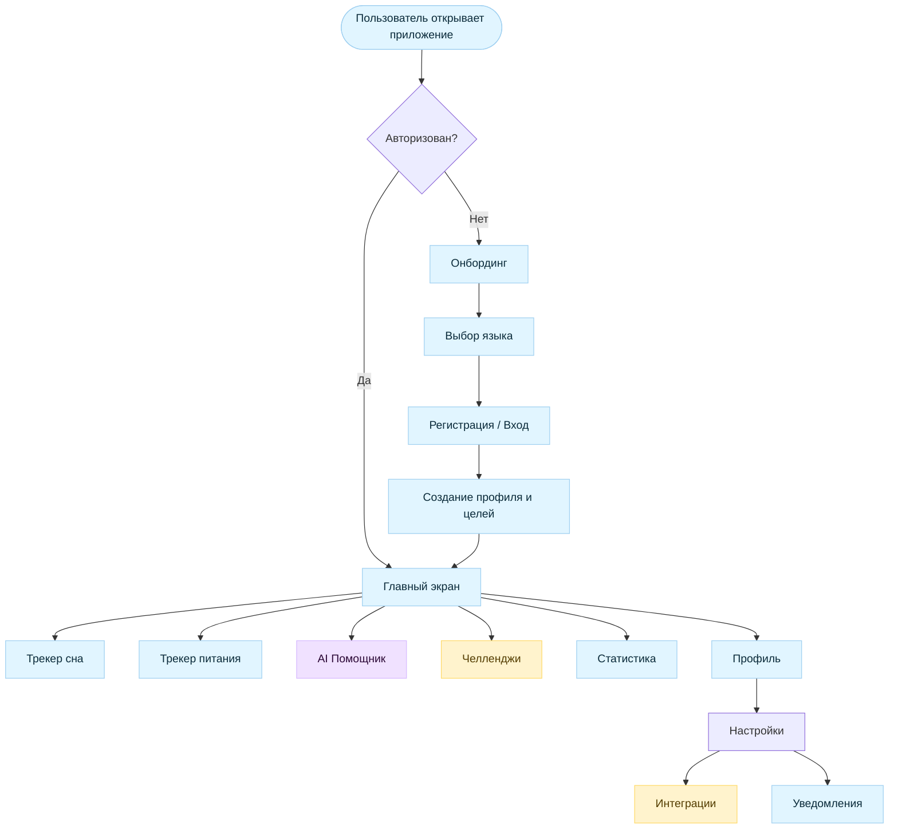
```mermaid
flowchart TB
        %% Обзорная диаграмма навигации
        Start([Пользователь открывает приложение]) --> CheckAuth{Авторизован?}
        CheckAuth -->|Нет| Onboarding[Онбординг]
        CheckAuth -->|Да| Dashboard[Главный экран]

        Onboarding --> Language[Выбор языка]
        Language --> Auth[Регистрация / Вход]
        Auth --> Profile[Создание профиля и целей]
        Profile --> Dashboard

        Dashboard --> Sleep[Трекер сна]
        Dashboard --> Nutrition[Трекер питания]
        Dashboard --> AI[AI Помощник]
        Dashboard --> Challenges[Челленджи]
        Dashboard --> Stats[Статистика]
        Dashboard --> ProfileScreen[Профиль]

        ProfileScreen --> Settings[Настройки]
        Settings --> Integrations[Интеграции]
        Settings --> Notifications[Уведомления]

        %% Стили и классы для цветов
        classDef mainFill fill:#e1f5ff,stroke:#9ecff0,color:#0b2b3a;
        classDef aiFill fill:#f0e1ff,stroke:#d6b8ff,color:#2b0836;
        classDef premiumFill fill:#fff3cd,stroke:#ffd966,color:#543d00;
        classDef successFill fill:#e6ffed,stroke:#9fe8b3,color:#023b12;
        classDef warnFill fill:#ffe1e1,stroke:#ff9e9e,color:#4b0000;

        class Start,Onboarding,Language,Auth,Profile,Dashboard mainFill;
        class Sleep,Nutrition mainFill;
        class AI aiFill;
        class Challenges premiumFill;
        class Stats,ProfileScreen mainFill;
        class Integrations premiumFill;
        class Notifications mainFill;
```

---

#### 2) Онбординг — детальный flow (mermaid)

```mermaid
flowchart TD
        Splash([Splash / Welcome]) --> Onboard1[Слайд 1: Что такое WellBee]
        Onboard1 --> Onboard2[Слайд 2: AI и трекинг]
        Onboard2 --> Onboard3[Слайд 3: Челленджи и геймификация]
        Onboard3 --> Lang[Выбор языка]
        Lang --> AuthOptions{Способ входа}
        AuthOptions --> Email[Email]
        AuthOptions --> Phone[Телефон (OTP)]
        AuthOptions --> Social[OAuth (Apple/Google)]
        AuthOptions --> Skip[Пропустить (гость)]
        Email --> CreateAcc[Создать аккаунт]
        Phone --> VerifyOTP[Ввод кода]
        Social --> CreateAcc
        Skip --> ProfileSetup
        CreateAcc --> ProfileSetup[Настройка профиля]
        ProfileSetup --> Goals[Выбор целей]
        Goals --> NotificationsPerm{Разрешения}
        NotificationsPerm -->|Да| EnableNotif[Уведомления включены]
        NotificationsPerm -->|Нет| DenyNotif[Отклонено]
        EnableNotif --> FirstLanding[Переход на Dashboard]
        DenyNotif --> FirstLanding

        classDef blue fill:#e1f5ff,stroke:#9ecff0;
        classDef green fill:#e6ffed,stroke:#9fe8b3;
        classDef purple fill:#f0e1ff,stroke:#d6b8ff;

        class Splash,Onboard1,Onboard2,Onboard3,Lang,AuthOptions blue;
        class ProfileSetup,Goals green;
        class Email,Phone,Social purple;
```

---

#### 3) Dashboard — блоки и взаимодействия (mermaid)

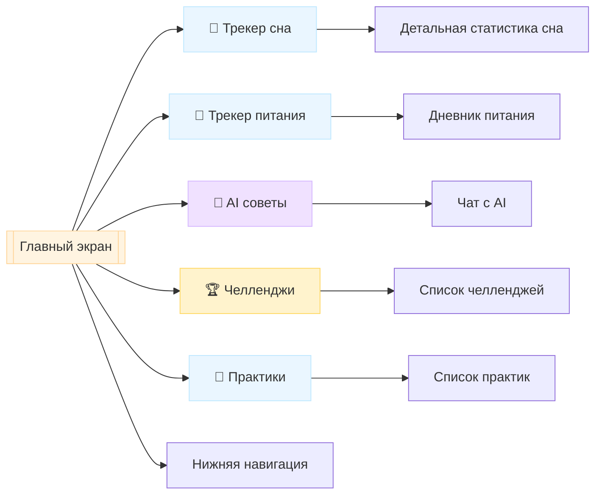
```mermaid
flowchart LR
        Dashboard[[Главный экран]]
        Dashboard --> SleepCard[🌙 Трекер сна]
        Dashboard --> NutritionCard[🍎 Трекер питания]
        Dashboard --> AICard[🤖 AI советы]
        Dashboard --> ChallengeCard[🏆 Челленджи]
        Dashboard --> PracticeCard[🧘 Практики]
        Dashboard --> BottomNav[Нижняя навигация]

        SleepCard --> SleepDetail[Детальная статистика сна]
        NutritionCard --> NutritionDetail[Дневник питания]
        AICard --> AIChat[Чат с AI]
        ChallengeCard --> ChallengesList[Список челленджей]
        PracticeCard --> PracticesList[Список практик]

        classDef dash fill:#fff4e1,stroke:#ffd59a;
        classDef card fill:#eaf6ff,stroke:#bfe8ff;
        classDef ai fill:#f0e1ff,stroke:#d6b8ff;
        classDef premium fill:#fff3cd,stroke:#ffd966;

        class Dashboard dash;
        class SleepCard,NutritionCard,PracticeCard card;
        class AICard ai;
        class ChallengeCard premium;
```

---

#### 4) Трекер сна — ключевые ветки (mermaid)

```mermaid
flowchart TB
        SleepMain[[Трекер сна]]
        SleepMain --> StartAuto[Начать авто-трекинг]
        SleepMain --> Manual[Ручной ввод сна]
        SleepMain --> History[История и графики]
        StartAuto --> Monitoring[Сбор данных (акселерометр, звук)]
        Monitoring --> Analyze[Определение фаз сна]
        Analyze --> Summary[Итог: длительность/качество]
        Summary --> AIInsights[AI: Корреляции и советы]
        Manual --> ManualForm[Форма ввода: время сна/пробужд]
        ManualForm --> SaveManual[Сохранить]

        classDef auto fill:#e1f0ff,stroke:#9ecff0;
        classDef manual fill:#fff4e1,stroke:#ffd59a;
        classDef insight fill:#f0e1ff,stroke:#d6b8ff;

        class StartAuto,Monitoring,Analyze auto;
        class Manual,ManualForm manual;
        class AIInsights insight;
```

---

#### 5) Трекер питания — ключевые ветки (mermaid)

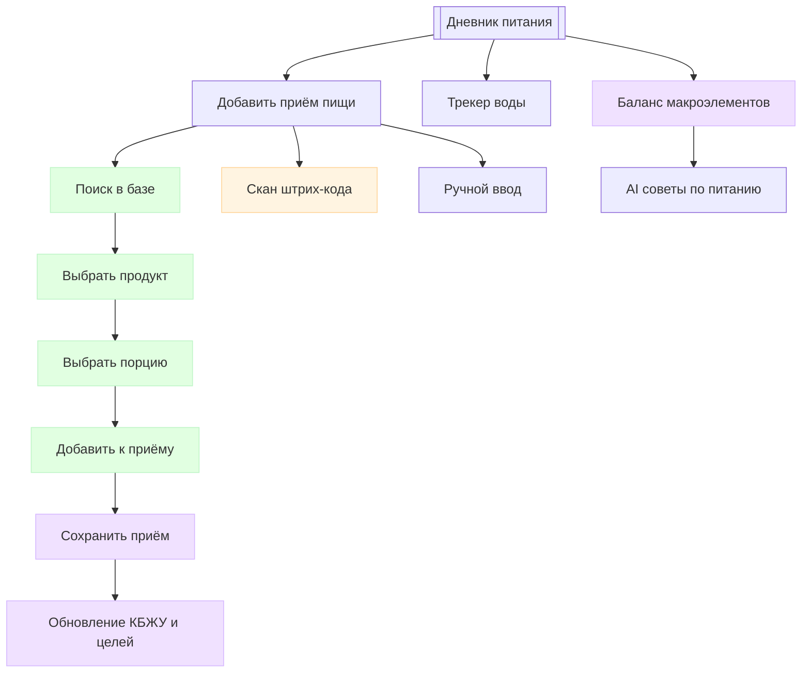
```mermaid
flowchart TB
        NutritionMain[[Дневник питания]]
        NutritionMain --> AddMeal[Добавить приём пищи]
        AddMeal --> SearchDB[Поиск в базе]
        AddMeal --> Barcode[Скан штрих-кода]
        AddMeal --> ManualInput[Ручной ввод]
        SearchDB --> SelectFood[Выбрать продукт]
        SelectFood --> Portion[Выбрать порцию]
        Portion --> AddToMeal[Добавить к приёму]
        AddToMeal --> SaveMeal[Сохранить приём]
        SaveMeal --> UpdateStats[Обновление КБЖУ и целей]
        NutritionMain --> Water[Трекер воды]
        NutritionMain --> Macros[Баланс макроэлементов]
        Macros --> AIAdviceNutrition[AI советы по питанию]

        classDef food fill:#e1ffe1,stroke:#bff5c7;
        classDef scan fill:#fff4e1,stroke:#ffd59a;
        classDef calc fill:#f0e1ff,stroke:#d6b8ff;

        class SearchDB,SelectFood,Portion,AddToMeal food;
        class Barcode scan;
        class SaveMeal,UpdateStats,Macros calc;
```

---

#### 6) AI-помощник — краткий flow (mermaid)

```mermaid
flowchart TB
        AIStart[[AI Помощник]]
        AIStart --> QuickActions[Быстрые действия]
        AIStart --> Chat[Чат (вопрос/ответ)]
        Chat --> AnalyzeData[AI анализ данных пользователя]
        AnalyzeData --> Recommendation[Рекомендации (сон/питание/практики)]
        Recommendation --> Action[Запустить практику / Установить напоминание]

        classDef ai2 fill:#f3e8ff,stroke:#d6b8ff;
        class AIStart,AnalyzeData,Recommendation ai2;
```

---

Скопируйте любой из блоков — и вставьте в Miro / Markdown-редактор с поддержкой Mermaid. В Miro можно настроить цвет и форму блоков вручную (используйте легенду выше).

---

### 1. ОНБОРДИНГ И РЕГИСТРАЦИЯ
### 1. ОНБОРДИНГ И РЕГИСТРАЦИЯ - Детальная диаграмма

**Точка входа: Открытие приложения**


```mermaid
graph TB
    Start([Пользователь скачивает<br/>и открывает WellBee]) --> Splash[Splash Screen]
    Splash --> Welcome[Экран приветствия]
    
    Welcome --> Slide1["Слайд 1/4<br/>🌟 Добро пожаловать в WellBee<br/>Ваш персональный помощник здоровья"]
    Slide1 -->|Свайп| Slide2["Слайд 2/4<br/>🤖 AI-Ассистент<br/>Умный анализ ваших данных"]
    Slide2 -->|Свайп| Slide3["Слайд 3/4<br/>📊 Трекинг здоровья<br/>Сон, питание, активность"]
    Slide3 -->|Свайп| Slide4["Слайд 4/4<br/>🏆 Геймификация<br/>Челленджи, баллы, достижения"]
    
    Slide4 --> LangSelect[Выбор языка интерфейса]
    
    LangSelect --> LangRU[🇷🇺 Русский]
    LangSelect --> LangKZ[🇰🇿 Қазақша]
    LangSelect --> LangEN[🇬🇧 English]
    
    LangRU --> AuthScreen[Экран входа/регистрации]
    LangKZ --> AuthScreen
    LangEN --> AuthScreen
    
    AuthScreen --> AuthEmail["📧 Вход через Email"]
    AuthScreen --> AuthPhone["📱 Вход через телефон"]
    AuthScreen --> AuthApple["🍎 Sign in with Apple"]
    AuthScreen --> AuthGoogle["🔵 Sign in with Google"]
    AuthScreen --> SkipAuth["⏭️ Пропустить (гость)"]
    
    AuthEmail --> EmailForm[Ввод Email и пароля]
    EmailForm --> EmailValidation{Валидация}
    EmailValidation -->|Ошибка| EmailError[Показать ошибку]
    EmailError --> EmailForm
    EmailValidation -->|Успех| AccountCreated[Аккаунт создан]
    
    AuthPhone --> PhoneForm[Ввод номера телефона]
    PhoneForm --> SendOTP[Отправка SMS кода]
    SendOTP --> EnterOTP[Ввод OTP кода]
    EnterOTP --> OTPValidation{Проверка кода}
    OTPValidation -->|Неверный| OTPError[Ошибка кода]
    OTPError --> EnterOTP
    OTPValidation -->|Верный| AccountCreated
    
    AuthApple --> OAuthFlow[OAuth авторизация]
    AuthGoogle --> OAuthFlow
    OAuthFlow --> AccountCreated
    
    SkipAuth --> ProfileSetup
    AccountCreated --> ProfileSetup[Настройка профиля]
    
    ProfileSetup --> EnterName[Введите имя]
    EnterName --> EnterAge[Укажите возраст]
    EnterAge --> SelectGender{Выберите пол}
    SelectGender --> Male[Мужской]
    SelectGender --> Female[Женский]
    SelectGender --> Other[Другое]
    
    Male --> PhotoUpload
    Female --> PhotoUpload
    Other --> PhotoUpload
    
    PhotoUpload{Добавить фото?}
    PhotoUpload -->|Да| Camera[Камера/Галерея]
    PhotoUpload -->|Позже| GoalsSetup
    Camera --> GoalsSetup[Установка целей]
    
    GoalsSetup --> GoalsList["Выберите цели:<br/>☑️ Улучшить качество сна<br/>☑️ Здоровое питание<br/>☑️ Снизить стресс<br/>☑️ Повысить энергию<br/>☑️ Медитация и осознанность<br/>☑️ Управление весом"]
    
    GoalsList --> LevelSelect{Выберите уровень опыта}
    LevelSelect --> Beginner[🌱 Начинающий]
    LevelSelect --> Intermediate[🌿 Средний]
    LevelSelect --> Advanced[🌳 Продвинутый]
    
    Beginner --> NotifPermission
    Intermediate --> NotifPermission
    Advanced --> NotifPermission
    
    NotifPermission{Разрешить уведомления?}
    NotifPermission -->|Разрешить| NotifEnabled[✓ Уведомления включены]
    NotifPermission -->|Не сейчас| NotifDisabled[Можно включить позже]
    
    NotifEnabled --> SetupComplete
    NotifDisabled --> SetupComplete
    
    SetupComplete["🎉 Настройка завершена!<br/>Ваш профиль готов"]
    SetupComplete --> Tutorial{Показать туториал?}
    Tutorial -->|Да| InteractiveTutorial[Интерактивная экскурсия]
    Tutorial -->|Пропустить| Dashboard
    InteractiveTutorial --> Dashboard[Переход на главный экран]
    
    style Start fill:#e1f5ff,stroke:#4a9eff,stroke-width:2px
    style Welcome fill:#e1f5ff,stroke:#4a9eff,stroke-width:2px
    style Slide1 fill:#e1f5ff,stroke:#4a9eff,stroke-width:2px
    style Slide2 fill:#e1f5ff,stroke:#4a9eff,stroke-width:2px
    style Slide3 fill:#e1f5ff,stroke:#4a9eff,stroke-width:2px
    style Slide4 fill:#e1f5ff,stroke:#4a9eff,stroke-width:2px
    style AuthScreen fill:#fff4e1,stroke:#ffa500,stroke-width:2px
    style AccountCreated fill:#d4edda,stroke:#28a745,stroke-width:2px
    style ProfileSetup fill:#fff4e1,stroke:#ffa500,stroke-width:2px
    style GoalsSetup fill:#fff4e1,stroke:#ffa500,stroke-width:2px
    style SetupComplete fill:#d4edda,stroke:#28a745,stroke-width:3px
    style Dashboard fill:#d4edda,stroke:#28a745,stroke-width:3px
    style OAuthFlow fill:#f0e1ff,stroke:#9b59b6,stroke-width:2px
```

---

### 2. СОЗДАНИЕ ПРОФИЛЯ И ЦЕЛЕЙ - Детальная диаграмма

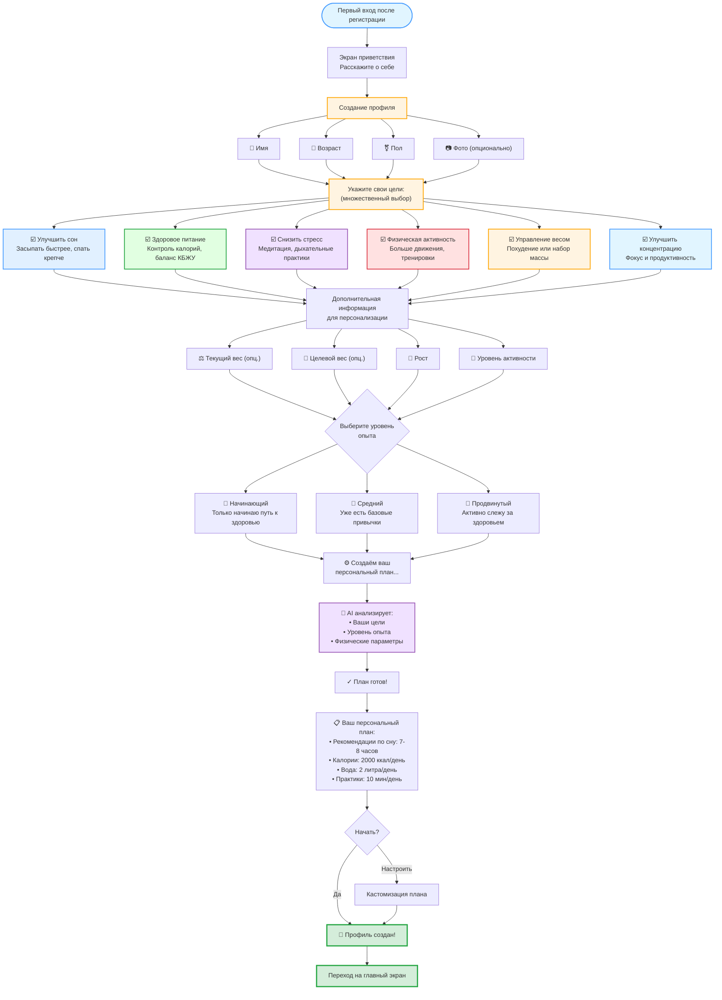
```mermaid
graph TB
    FirstLogin([Первый вход после регистрации]) --> ProfileIntro["Экран приветствия<br/>Расскажите о себе"]
    
    ProfileIntro --> ProfileForm[Создание профиля]
    ProfileForm --> Name["👤 Имя"]
    ProfileForm --> Age["🎂 Возраст"]
    ProfileForm --> Gender["⚧ Пол"]
    ProfileForm --> Photo["📷 Фото (опционально)"]
    
    Name --> GoalsScreen
    Age --> GoalsScreen
    Gender --> GoalsScreen
    Photo --> GoalsScreen
    
    GoalsScreen["Укажите свои цели:<br/>(множественный выбор)"]
    
    GoalsScreen --> Goal1["☑️ Улучшить сон<br/>Засыпать быстрее, спать крепче"]
    GoalsScreen --> Goal2["☑️ Здоровое питание<br/>Контроль калорий, баланс КБЖУ"]
    GoalsScreen --> Goal3["☑️ Снизить стресс<br/>Медитация, дыхательные практики"]
    GoalsScreen --> Goal4["☑️ Физическая активность<br/>Больше движения, тренировки"]
    GoalsScreen --> Goal5["☑️ Управление весом<br/>Похудение или набор массы"]
    GoalsScreen --> Goal6["☑️ Улучшить концентрацию<br/>Фокус и продуктивность"]
    
    Goal1 --> PersonalInfo
    Goal2 --> PersonalInfo
    Goal3 --> PersonalInfo
    Goal4 --> PersonalInfo
    Goal5 --> PersonalInfo
    Goal6 --> PersonalInfo
    
    PersonalInfo["Дополнительная информация<br/>для персонализации"]
    
    PersonalInfo --> CurrentWeight["⚖️ Текущий вес (опц.)"]
    PersonalInfo --> TargetWeight["🎯 Целевой вес (опц.)"]
    PersonalInfo --> Height["📏 Рост"]
    PersonalInfo --> ActivityLevel["🏃 Уровень активности"]
    
    CurrentWeight --> ExperienceLevel
    TargetWeight --> ExperienceLevel
    Height --> ExperienceLevel
    ActivityLevel --> ExperienceLevel
    
    ExperienceLevel{Выберите уровень<br/>опыта}
    
    ExperienceLevel --> Beginner["🌱 Начинающий<br/>Только начинаю путь к здоровью"]
    ExperienceLevel --> Intermediate["🌿 Средний<br/>Уже есть базовые привычки"]
    ExperienceLevel --> Advanced["🌳 Продвинутый<br/>Активно слежу за здоровьем"]
    
    Beginner --> CalculatingPlan
    Intermediate --> CalculatingPlan
    Advanced --> CalculatingPlan
    
    CalculatingPlan["⚙️ Создаём ваш<br/>персональный план..."]
    
    CalculatingPlan --> AIAnalysis["🤖 AI анализирует:<br/>• Ваши цели<br/>• Уровень опыта<br/>• Физические параметры"]
    
    AIAnalysis --> PlanReady["✓ План готов!"]
    
    PlanReady --> ShowPlan["📋 Ваш персональный план:<br/>• Рекомендации по сну: 7-8 часов<br/>• Калории: 2000 ккал/день<br/>• Вода: 2 литра/день<br/>• Практики: 10 мин/день"]
    
    ShowPlan --> AcceptPlan{Начать?}
    AcceptPlan -->|Да| ProfileComplete
    AcceptPlan -->|Настроить| CustomizePlan
    
    CustomizePlan[Кастомизация плана] --> ProfileComplete
    
    ProfileComplete["🎉 Профиль создан!"]
    ProfileComplete --> FirstDashboard[Переход на главный экран]
    
    style FirstLogin fill:#e1f5ff,stroke:#4a9eff,stroke-width:2px
    style ProfileForm fill:#fff4e1,stroke:#ffa500,stroke-width:2px
    style GoalsScreen fill:#fff4e1,stroke:#ffa500,stroke-width:2px
    style Goal1 fill:#e1f0ff,stroke:#4a9eff,stroke-width:2px
    style Goal2 fill:#e1ffe1,stroke:#28a745,stroke-width:2px
    style Goal3 fill:#f0e1ff,stroke:#9b59b6,stroke-width:2px
    style Goal4 fill:#ffe1e1,stroke:#dc3545,stroke-width:2px
    style Goal5 fill:#fff4e1,stroke:#ffa500,stroke-width:2px
    style Goal6 fill:#e1f5ff,stroke:#4a9eff,stroke-width:2px
    style AIAnalysis fill:#f0e1ff,stroke:#9b59b6,stroke-width:2px
    style ProfileComplete fill:#d4edda,stroke:#28a745,stroke-width:3px
    style FirstDashboard fill:#d4edda,stroke:#28a745,stroke-width:3px
```

---

### 3. ГЛАВНЫЙ ЭКРАН (Dashboard) - Интерактивная структура


```mermaid
graph TB
    Dashboard([🏠 ГЛАВНЫЙ ЭКРАН<br/>WellBee]) --> Header[Header Section]
    Dashboard --> Progress[Progress Section]
    Dashboard --> Cards[Cards Section]
    Dashboard --> BottomNav[Bottom Navigation]
    
    Header --> Greeting["Приветствие:<br/>🌅 Доброе утро, Имя!"]
    Header --> Streak["🔥 Серия: 7 дней"]
    Header --> Points["⭐ Баллы: 1,250"]
    Header --> ProfileIcon["👤 Иконка профиля"]
    
    ProfileIcon -->|Клик| ProfileScreen[Профиль пользователя]
    Streak -->|Клик| StreakDetails[История серии]
    Points -->|Клик| PointsHistory[История баллов]
    
    Progress --> DailyProgress["📊 Прогресс сегодня: 65%"]
    DailyProgress --> ProgressBar[Визуальный прогресс-бар]
    ProgressBar --> ProgressDetail["Детализация:<br/>✓ Сон: 100%<br/>◐ Питание: 75%<br/>◐ Активность: 50%<br/>○ Практики: 0%"]
    
    Cards --> SleepCard["🌙 ТРЕКЕР СНА<br/>─────────────<br/>Сегодня: 7ч 30м<br/>Качество: Хорошо<br/>💤💤💤💤💤<br/>─────────────<br/>➕ Добавить данные"]
    Cards --> NutritionCard["� ТРЕКЕР ПИТАНИЯ<br/>─────────────<br/>1,200 / 2,000 ккал<br/>Вода: 6/8 💧<br/>Б: 45/80г | У: 120/200г<br/>─────────────<br/>➕ Добавить приём"]
    Cards --> AICard["🤖 AI СОВЕТЫ<br/>─────────────<br/>💡 Совет дня:<br/>'Попробуйте медитацию<br/>перед сном'<br/>─────────────<br/>💬 Спросить AI"]
    Cards --> ChallengeCard["🏆 ЧЕЛЛЕНДЖИ<br/>─────────────<br/>Активный:<br/>'7 дней здорового сна'<br/>День 3/7 ●●●○○○○<br/>─────────────<br/>Продолжить →"]
    Cards --> PracticeCard["🧘 ПРАКТИКИ<br/>─────────────<br/>Рекомендуем:<br/>'Дыхание 4-7-8'<br/>5 минут<br/>─────────────<br/>▶️ Начать"]
    Cards --> ActivityCard["🏃 АКТИВНОСТЬ<br/>─────────────<br/>Сегодня:<br/>8,500 / 10,000 шагов<br/>Калории: 450 ккал<br/>─────────────<br/>🔄 Синхронизировать"]
    
    SleepCard -->|Клик карточки| SleepTracker[Трекер сна]
    NutritionCard -->|Клик карточки| NutritionTracker[Трекер питания]
    AICard -->|Клик карточки| AIAssistant[AI Помощник]
    ChallengeCard -->|Клик карточки| ChallengesScreen[Челленджи]
    PracticeCard -->|Клик карточки| PracticesScreen[Практики]
    ActivityCard -->|Клик карточки| ActivityTracker[Активность]
    
    SleepCard -->|Клик кнопки| AddSleep[Добавить сон]
    NutritionCard -->|Клик кнопки| AddMeal[Добавить приём]
    AICard -->|Клик кнопки| AIChatScreen[Чат с AI]
    ChallengeCard -->|Клик кнопки| ContinueChallenge[Продолжить челлендж]
    PracticeCard -->|Клик кнопки| StartPractice[Начать практику]
    ActivityCard -->|Клик кнопки| SyncDevice[Синхронизация]
    
    BottomNav --> NavHome["🏠 Главная<br/>(активна)"]
    BottomNav --> NavStats["📊 Статистика"]
    BottomNav --> NavAI["🤖 AI"]
    BottomNav --> NavProfile["👤 Профиль"]
    
    NavStats -->|Клик| StatsScreen[Экран статистики]
    NavAI -->|Клик| AIScreen[Экран AI]
    NavProfile -->|Клик| ProfileScreen
    
    Dashboard --> PullRefresh["⬇️ Pull to Refresh"]
    PullRefresh --> RefreshData[Обновление данных]
    RefreshData --> Dashboard
    
    Dashboard --> AdCheck{Premium статус?}
    AdCheck -->|Free| ShowAd["📢 Рекламный баннер<br/>(внизу экрана)"]
    AdCheck -->|Premium| NoAd["✓ Без рекламы"]
    
    style Dashboard fill:#fff4e1,stroke:#ffa500,stroke-width:3px
    style Header fill:#e1f5ff,stroke:#4a9eff,stroke-width:2px
    style Progress fill:#e1ffe1,stroke:#28a745,stroke-width:2px
    style SleepCard fill:#e1f0ff,stroke:#4a9eff,stroke-width:2px
    style NutritionCard fill:#e1ffe1,stroke:#28a745,stroke-width:2px
    style AICard fill:#f0e1ff,stroke:#9b59b6,stroke-width:2px
    style ChallengeCard fill:#fff4e1,stroke:#ffa500,stroke-width:2px
    style PracticeCard fill:#f0e1ff,stroke:#9b59b6,stroke-width:2px
    style ActivityCard fill:#ffe1e1,stroke:#dc3545,stroke-width:2px
    style BottomNav fill:#f8f9fa,stroke:#6c757d,stroke-width:2px
```

---

### 4. ТРЕКЕР СНА - Полный детальный Flow

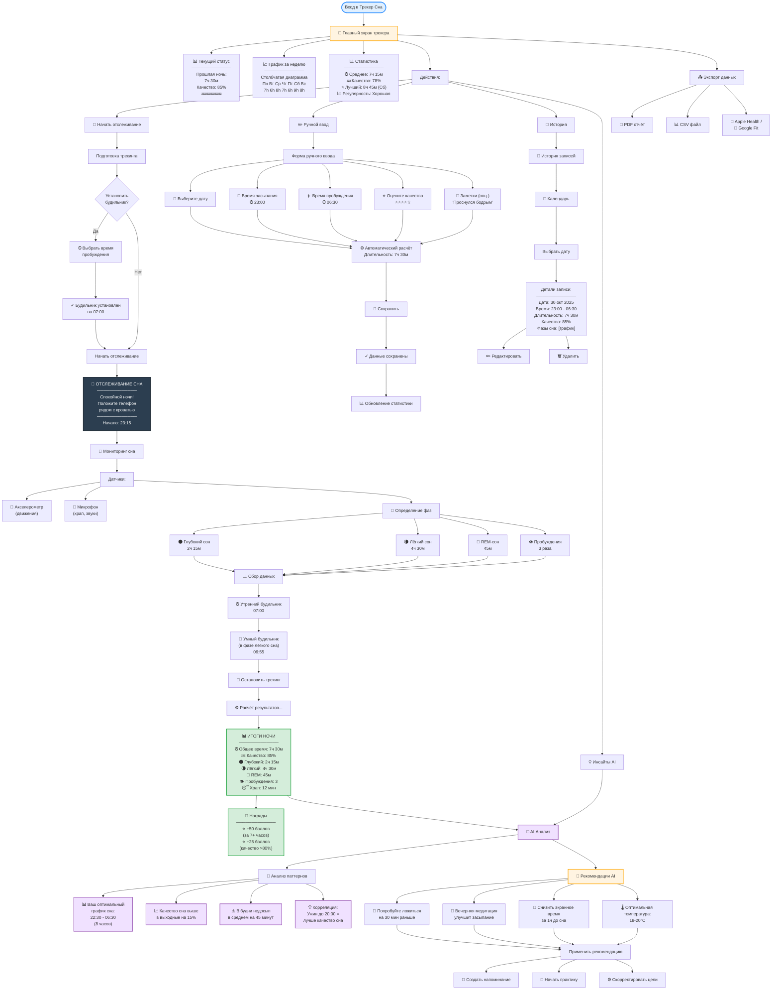
```mermaid
graph TB
    SleepEntry([Вход в Трекер Сна]) --> SleepMain[🌙 Главный экран трекера]
    
    SleepMain --> CurrentStatus["📊 Текущий статус<br/>─────────────<br/>Прошлая ночь:<br/>7ч 30м<br/>Качество: 85%<br/>💤💤💤💤💤"]
    
    SleepMain --> WeeklyChart["📈 График за неделю<br/>─────────────<br/>Столбчатая диаграмма<br/>Пн Вт Ср Чт Пт Сб Вс<br/>7h 6h 8h 7h 6h 9h 8h"]
    
    SleepMain --> Stats["📊 Статистика<br/>─────────────<br/>⏰ Среднее: 7ч 15м<br/>💤 Качество: 78%<br/>⭐ Лучший: 8ч 45м (Сб)<br/>📈 Регулярность: Хорошая"]
    
    SleepMain --> Actions["Действия:"]
    Actions --> TrackSleep["🌙 Начать отслеживание"]
    Actions --> ManualEntry["✏️ Ручной ввод"]
    Actions --> ViewHistory["📖 История"]
    Actions --> Insights["💡 Инсайты AI"]
    
    TrackSleep --> PrepareTracking["Подготовка трекинга"]
    PrepareTracking --> SetAlarm{Установить<br/>будильник?}
    SetAlarm -->|Да| SelectTime["⏰ Выбрать время<br/>пробуждения"]
    SetAlarm -->|Нет| StartTracking
    SelectTime --> AlarmSet["✓ Будильник установлен<br/>на 07:00"]
    AlarmSet --> StartTracking["Начать отслеживание"]
    
    StartTracking --> TrackingScreen["🌙 ОТСЛЕЖИВАНИЕ СНА<br/>─────────────<br/>Спокойной ночи!<br/>Положите телефон<br/>рядом с кроватью<br/>─────────────<br/>Начало: 23:15"]
    
    TrackingScreen --> Monitoring["🔄 Мониторинг сна"]
    Monitoring --> Sensors["Датчики:"]
    Sensors --> Accelerometer["📱 Акселерометр<br/>(движения)"]
    Sensors --> Microphone["🎤 Микрофон<br/>(храп, звуки)"]
    Sensors --> PhaseDetection["🧠 Определение фаз"]
    
    PhaseDetection --> DeepSleep["🌑 Глубокий сон<br/>2ч 15м"]
    PhaseDetection --> LightSleep["🌘 Лёгкий сон<br/>4ч 30м"]
    PhaseDetection --> REMSleep["🌙 REM-сон<br/>45м"]
    PhaseDetection --> Awake["👁️ Пробуждения<br/>3 раза"]
    
    DeepSleep --> DataCollection
    LightSleep --> DataCollection
    REMSleep --> DataCollection
    Awake --> DataCollection
    
    DataCollection["📊 Сбор данных"]
    DataCollection --> MorningAlarm["⏰ Утренний будильник<br/>07:00"]
    MorningAlarm --> SmartWake["🧠 Умный будильник<br/>(в фазе лёгкого сна)<br/>06:55"]
    SmartWake --> StopTracking["🛑 Остановить трекинг"]
    
    StopTracking --> Calculate["⚙️ Расчёт результатов..."]
    Calculate --> Results["📊 ИТОГИ НОЧИ<br/>─────────────<br/>⏰ Общее время: 7ч 30м<br/>💤 Качество: 85%<br/>🌑 Глубокий: 2ч 15м<br/>🌘 Лёгкий: 4ч 30м<br/>🌙 REM: 45м<br/>👁️ Пробуждения: 3<br/>😴 Храп: 12 мин"]
    
    Results --> EarnPoints["🎉 Награды<br/>─────────────<br/>⭐ +50 баллов<br/>(за 7+ часов)<br/>⭐ +25 баллов<br/>(качество >80%)"]
    
    Results --> AIAnalysisFlow["🤖 AI Анализ"]
    
    ManualEntry --> ManualForm["Форма ручного ввода"]
    ManualForm --> SelectDate["📅 Выберите дату"]
    ManualForm --> EnterBedtime["🌙 Время засыпания<br/>⏰ 23:00"]
    ManualForm --> EnterWakeup["☀️ Время пробуждения<br/>⏰ 06:30"]
    ManualForm --> RateQuality["⭐ Оцените качество<br/>⭐⭐⭐⭐☆"]
    ManualForm --> AddNotes["📝 Заметки (опц.)<br/>'Проснулся бодрым'"]
    
    SelectDate --> Calculate2
    EnterBedtime --> Calculate2
    EnterWakeup --> Calculate2
    RateQuality --> Calculate2
    AddNotes --> Calculate2
    
    Calculate2["⚙️ Автоматический расчёт<br/>Длительность: 7ч 30м"]
    Calculate2 --> SaveManual["💾 Сохранить"]
    SaveManual --> ManualSaved["✓ Данные сохранены"]
    ManualSaved --> UpdateStats["📊 Обновление статистики"]
    
    ViewHistory --> HistoryList["📖 История записей"]
    HistoryList --> Calendar["📅 Календарь"]
    Calendar --> SelectHistoryDate["Выбрать дату"]
    SelectHistoryDate --> ShowDetails["Детали записи:<br/>─────────────<br/>Дата: 30 окт 2025<br/>Время: 23:00 - 06:30<br/>Длительность: 7ч 30м<br/>Качество: 85%<br/>Фазы сна: [график]"]
    ShowDetails --> EditEntry["✏️ Редактировать"]
    ShowDetails --> DeleteEntry["🗑️ Удалить"]
    
    Insights --> AIAnalysisFlow
    AIAnalysisFlow --> AnalyzePatterns["🧠 Анализ паттернов"]
    
    AnalyzePatterns --> Pattern1["📊 Ваш оптимальный<br/>график сна:<br/>22:30 - 06:30<br/>(8 часов)"]
    AnalyzePatterns --> Pattern2["📈 Качество сна выше<br/>в выходные на 15%"]
    AnalyzePatterns --> Pattern3["⚠️ В будни недосып<br/>в среднем на 45 минут"]
    AnalyzePatterns --> Pattern4["💡 Корреляция:<br/>Ужин до 20:00 =<br/>лучше качество сна"]
    
    AIAnalysisFlow --> Recommendations["🎯 Рекомендации AI"]
    Recommendations --> Rec1["🎯 Попробуйте ложиться<br/>на 30 мин раньше"]
    Recommendations --> Rec2["🧘 Вечерняя медитация<br/>улучшит засыпание"]
    Recommendations --> Rec3["📵 Снизить экранное время<br/>за 1ч до сна"]
    Recommendations --> Rec4["🌡️ Оптимальная температура:<br/>18-20°C"]
    
    Rec1 --> ApplyRec["Применить рекомендацию"]
    Rec2 --> ApplyRec
    Rec3 --> ApplyRec
    Rec4 --> ApplyRec
    
    ApplyRec --> CreateReminder["🔔 Создать напоминание"]
    ApplyRec --> StartPractice["🧘 Начать практику"]
    ApplyRec --> AdjustGoals["⚙️ Скорректировать цели"]
    
    SleepMain --> ExportData["📤 Экспорт данных"]
    ExportData --> ExportPDF["📄 PDF отчёт"]
    ExportData --> ExportCSV["📊 CSV файл"]
    ExportData --> ShareHealth["🍎 Apple Health /<br/>📱 Google Fit"]
    
    style SleepEntry fill:#e1f0ff,stroke:#4a9eff,stroke-width:3px
    style SleepMain fill:#fff4e1,stroke:#ffa500,stroke-width:2px
    style TrackingScreen fill:#2c3e50,stroke:#1a252f,stroke-width:2px,color:#fff
    style Results fill:#d4edda,stroke:#28a745,stroke-width:2px
    style EarnPoints fill:#d4edda,stroke:#28a745,stroke-width:2px
    style AIAnalysisFlow fill:#f0e1ff,stroke:#9b59b6,stroke-width:2px
    style Pattern1 fill:#f0e1ff,stroke:#9b59b6,stroke-width:2px
    style Pattern2 fill:#f0e1ff,stroke:#9b59b6,stroke-width:2px
    style Pattern3 fill:#f0e1ff,stroke:#9b59b6,stroke-width:2px
    style Pattern4 fill:#f0e1ff,stroke:#9b59b6,stroke-width:2px
    style Recommendations fill:#fff4e1,stroke:#ffa500,stroke-width:2px
```

---

### 5. ТРЕКЕР ПИТАНИЯ - Детальный Flow с КБЖУ

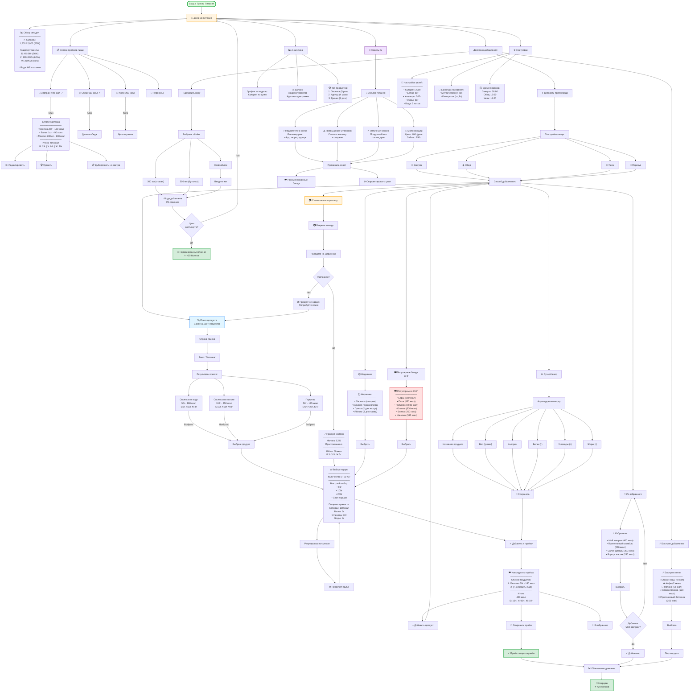
```mermaid
graph TB
    NutritionEntry([Вход в Трекер Питания]) --> NutritionMain["🍎 Дневник питания"]
    
    NutritionMain --> TodayOverview["📊 Обзор сегодня<br/>─────────────<br/>🔥 Калории:<br/>1,200 / 2,000 (60%)<br/>─────────────<br/>Макронутриенты:<br/>Б: 45г/80г (56%)<br/>У: 120г/200г (60%)<br/>Ж: 30г/60г (50%)<br/>─────────────<br/>💧 Вода: 6/8 стаканов"]
    
    NutritionMain --> MealsList["📋 Список приёмов пищи"]
    MealsList --> Breakfast["🌅 Завтрак: 400 ккал ✓"]
    MealsList --> Lunch["☀️ Обед: 600 ккал ✓"]
    MealsList --> Dinner["🌆 Ужин: 200 ккал"]
    MealsList --> Snacks["🍎 Перекусы: —"]
    
    Breakfast -->|Клик| ViewMeal1["Детали завтрака<br/>─────────────<br/>• Овсянка 50г - 180 ккал<br/>• Банан 1шт - 90 ккал<br/>• Молоко 200мл - 130 ккал<br/>─────────────<br/>Итого: 400 ккал<br/>Б: 15г | У: 60г | Ж: 10г"]
    Lunch -->|Клик| ViewMeal2["Детали обеда"]
    Dinner -->|Клик| ViewMeal3["Детали ужина"]
    
    ViewMeal1 --> EditMeal["✏️ Редактировать"]
    ViewMeal1 --> DeleteMeal["🗑️ Удалить"]
    ViewMeal1 --> DuplicateMeal["📋 Дублировать на завтра"]
    
    NutritionMain --> AddActions["Действия добавления:"]
    AddActions --> AddMealBtn["➕ Добавить приём пищи"]
    AddActions --> AddWater["💧 Добавить воду"]
    AddActions --> QuickAdd["⚡ Быстрое добавление"]
    
    AddMealBtn --> SelectMealType["Тип приёма пищи:"]
    SelectMealType --> TypeBreakfast["🌅 Завтрак"]
    SelectMealType --> TypeLunch["☀️ Обед"]
    SelectMealType --> TypeDinner["🌆 Ужин"]
    SelectMealType --> TypeSnack["🍎 Перекус"]
    
    TypeBreakfast --> AddFoodMethod
    TypeLunch --> AddFoodMethod
    TypeDinner --> AddFoodMethod
    TypeSnack --> AddFoodMethod
    
    AddFoodMethod["Способ добавления:"]
    AddFoodMethod --> SearchFood["🔍 Поиск продукта<br/>База: 50,000+ продуктов"]
    AddFoodMethod --> ScanBarcode["📷 Сканировать штрих-код"]
    AddFoodMethod --> ManualInput["✏️ Ручной ввод"]
    AddFoodMethod --> FromFavorites["⭐ Из избранного"]
    AddFoodMethod --> RecentFoods["🕐 Недавние"]
    AddFoodMethod --> PopularDishes["🍽️ Популярные блюда СНГ"]
    
    SearchFood --> SearchBar["Строка поиска"]
    SearchBar --> SearchQuery["Ввод: 'Овсянка'"]
    SearchQuery --> SearchResults["Результаты поиска:"]
    
    SearchResults --> Result1["Овсянка на воде<br/>50г - 180 ккал<br/>Б:6г У:30г Ж:4г"]
    SearchResults --> Result2["Овсянка на молоке<br/>100г - 350 ккал<br/>Б:12г У:50г Ж:8г"]
    SearchResults --> Result3["Геркулес<br/>50г - 175 ккал<br/>Б:6г У:28г Ж:4г"]
    
    Result1 -->|Выбрать| SelectFood["Выбран продукт"]
    Result2 -->|Выбрать| SelectFood
    Result3 -->|Выбрать| SelectFood
    
    SelectFood --> PortionScreen["⚖️ Выбор порции<br/>─────────────<br/>Количество: [- 50 +] г<br/>─────────────<br/>Быстрый выбор:<br/>• 50г<br/>• 100г<br/>• 200г<br/>• Своя порция<br/>─────────────<br/>Пищевая ценность:<br/>Калории: 180 ккал<br/>Белки: 6г<br/>Углеводы: 30г<br/>Жиры: 4г"]
    
    PortionScreen --> AdjustPortion["Регулировка ползунком"]
    AdjustPortion --> UpdateNutrition["⚙️ Пересчёт КБЖУ"]
    UpdateNutrition --> PortionScreen
    
    PortionScreen --> AddToMeal["✓ Добавить к приёму"]
    AddToMeal --> MealBuilder["🍽️ Конструктор приёма<br/>─────────────<br/>Список продуктов:<br/>1. Овсянка 50г - 180 ккал<br/>2. [+ Добавить ещё]<br/>─────────────<br/>Итого:<br/>400 ккал<br/>Б: 15г | У: 60г | Ж: 10г"]
    
    MealBuilder --> AddMoreFood["+ Добавить продукт"]
    AddMoreFood --> AddFoodMethod
    
    MealBuilder --> SaveMeal["💾 Сохранить приём"]
    MealBuilder --> AddToFavorites["⭐ В избранное"]
    
    SaveMeal --> MealSaved["✓ Приём пищи сохранён"]
    MealSaved --> UpdateDiary["📊 Обновление дневника"]
    UpdateDiary --> EarnPointsNutr["🎉 Награды<br/>⭐ +20 баллов"]
    
    ScanBarcode --> CameraOpen["📷 Открыть камеру"]
    CameraOpen --> ScanProcess["Наведите на штрих-код"]
    ScanProcess --> BarcodeDetect{Распознан?}
    BarcodeDetect -->|Да| ProductFound["✓ Продукт найден<br/>─────────────<br/>Молоко 3.2%<br/>Простоквашино<br/>─────────────<br/>100мл: 60 ккал<br/>Б:3г У:5г Ж:3г"]
    BarcodeDetect -->|Нет| ScanError["❌ Продукт не найден<br/>Попробуйте поиск"]
    
    ProductFound --> PortionScreen
    ScanError --> SearchFood
    
    ManualInput --> ManualForm["Форма ручного ввода<br/>─────────────"]
    ManualForm --> InputName["Название продукта"]
    ManualForm --> InputWeight["Вес (грамм)"]
    ManualForm --> InputCalories["Калории"]
    ManualForm --> InputProteins["Белки (г)"]
    ManualForm --> InputCarbs["Углеводы (г)"]
    ManualForm --> InputFats["Жиры (г)"]
    
    InputName --> SaveManualFood
    InputWeight --> SaveManualFood
    InputCalories --> SaveManualFood
    InputProteins --> SaveManualFood
    InputCarbs --> SaveManualFood
    InputFats --> SaveManualFood
    
    SaveManualFood["💾 Сохранить"] --> AddToMeal
    
    FromFavorites --> FavoritesList["⭐ Избранное:<br/>─────────────<br/>• Мой завтрак (400 ккал)<br/>• Протеиновый коктейль (250 ккал)<br/>• Салат Цезарь (350 ккал)<br/>• Борщ с мясом (280 ккал)"]
    FavoritesList --> SelectFavorite["Выбрать"]
    SelectFavorite --> QuickAddConfirm{Добавить<br/>'Мой завтрак'?}
    QuickAddConfirm -->|Да| AddFavoriteToMeal["✓ Добавлено"]
    QuickAddConfirm -->|Нет| FromFavorites
    AddFavoriteToMeal --> UpdateDiary
    
    RecentFoods --> RecentList["🕐 Недавние:<br/>─────────────<br/>• Овсянка (сегодня)<br/>• Куриная грудка (вчера)<br/>• Гречка (2 дня назад)<br/>• Яблоко (3 дня назад)"]
    RecentList --> SelectRecent["Выбрать"]
    SelectRecent --> PortionScreen
    
    PopularDishes --> PopularList["🍽️ Популярные в СНГ:<br/>─────────────<br/>• Борщ (350 ккал)<br/>• Плов (450 ккал)<br/>• Пельмени (500 ккал)<br/>• Оливье (300 ккал)<br/>• Блины (250 ккал)<br/>• Шашлык (380 ккал)"]
    PopularList --> SelectPopular["Выбрать"]
    SelectPopular --> PortionScreen
    
    AddWater --> WaterAmount["Выбрать объём:"]
    WaterAmount --> Water200["200 мл (стакан)"]
    WaterAmount --> Water500["500 мл (бутылка)"]
    WaterAmount --> WaterCustom["Свой объём"]
    
    Water200 --> WaterAdded
    Water500 --> WaterAdded
    WaterCustom --> InputWaterAmount["Введите мл"]
    InputWaterAmount --> WaterAdded
    
    WaterAdded["💧 Вода добавлена<br/>6/8 стаканов"]
    WaterAdded --> CheckWaterGoal{Цель<br/>достигнута?}
    CheckWaterGoal -->|Да| WaterCelebration["🎉 Норма воды выполнена!<br/>⭐ +10 баллов"]
    CheckWaterGoal -->|Нет| NutritionMain
    
    QuickAdd --> QuickAddMenu["⚡ Быстрое меню:<br/>─────────────<br/>💧 Стакан воды (0 ккал)<br/>☕ Кофе (2 ккал)<br/>🍎 Яблоко (52 ккал)<br/>🥛 Стакан молока (120 ккал)<br/>🍫 Протеиновый батончик (200 ккал)"]
    QuickAddMenu --> QuickSelect["Выбрать"]
    QuickSelect --> QuickConfirm["Подтвердить"]
    QuickConfirm --> UpdateDiary
    
    NutritionMain --> Analytics["📊 Аналитика"]
    Analytics --> WeeklyTrend["График за неделю:<br/>Калории по дням"]
    Analytics --> MacroBalance["⚖️ Баланс макронутриентов<br/>Круговая диаграмма"]
    Analytics --> TopFoods["🏆 Топ продуктов:<br/>1. Овсянка (5 раз)<br/>2. Курица (4 раза)<br/>3. Гречка (3 раза)"]
    
    NutritionMain --> AIAdviceNutr["🤖 Советы AI"]
    AIAdviceNutr --> AnalyzeNutrition["🧠 Анализ питания"]
    
    AnalyzeNutrition --> Advice1["💡 Недостаточно белка<br/>Рекомендуем:<br/>яйца, творог, курица"]
    AnalyzeNutrition --> Advice2["⚠️ Превышение углеводов<br/>Снизьте выпечку<br/>и сладкое"]
    AnalyzeNutrition --> Advice3["✓ Отличный баланс<br/>Продолжайте в<br/>том же духе!"]
    AnalyzeNutrition --> Advice4["🥗 Мало овощей<br/>Цель: 400г/день<br/>Сейчас: 150г"]
    
    Advice1 --> ApplyAdvice["Применить совет"]
    Advice2 --> ApplyAdvice
    Advice3 --> ApplyAdvice
    Advice4 --> ApplyAdvice
    
    ApplyAdvice --> SuggestMeals["🍽️ Рекомендованные блюда"]
    ApplyAdvice --> AdjustGoalsNutr["⚙️ Скорректировать цели"]
    
    NutritionMain --> Settings["⚙️ Настройки"]
    Settings --> GoalsConfig["🎯 Настройка целей:<br/>─────────────<br/>• Калории: 2000<br/>• Белки: 80г<br/>• Углеводы: 200г<br/>• Жиры: 60г<br/>• Вода: 2 литра"]
    Settings --> UnitsConfig["📏 Единицы измерения:<br/>• Метрическая (г, мл)<br/>• Имперская (oz, lb)"]
    Settings --> MealTimes["🕐 Время приёмов:<br/>Завтрак: 08:00<br/>Обед: 13:00<br/>Ужин: 19:00"]
    
    style NutritionEntry fill:#e1ffe1,stroke:#28a745,stroke-width:3px
    style NutritionMain fill:#fff4e1,stroke:#ffa500,stroke-width:2px
    style AIAdviceNutr fill:#f0e1ff,stroke:#9b59b6,stroke-width:2px
    style MealSaved fill:#d4edda,stroke:#28a745,stroke-width:2px
    style WaterCelebration fill:#d4edda,stroke:#28a745,stroke-width:2px
    style EarnPointsNutr fill:#d4edda,stroke:#28a745,stroke-width:2px
    style SearchFood fill:#e1f5ff,stroke:#4a9eff,stroke-width:2px
    style ScanBarcode fill:#fff4e1,stroke:#ffa500,stroke-width:2px
    style PopularList fill:#ffe1e1,stroke:#dc3545,stroke-width:2px
```

---

### 6. AI ПОМОЩНИК - Детальный Flow с персонализацией

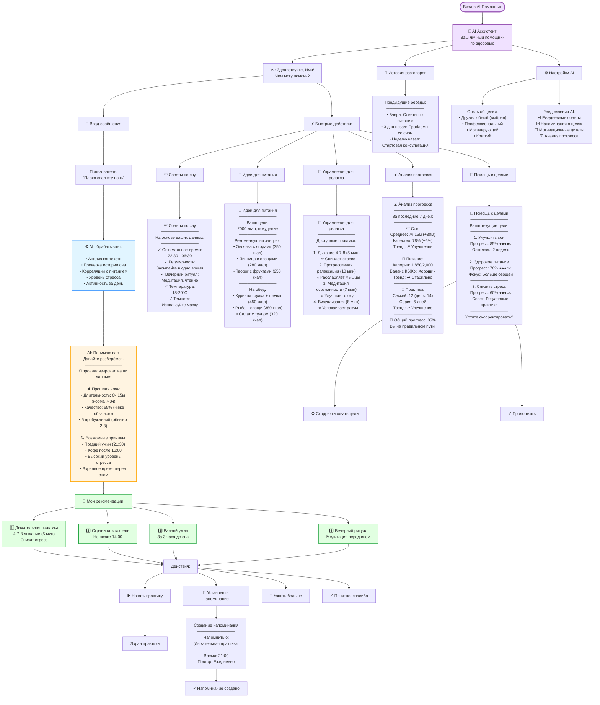
```mermaid
graph TB
    AIEntry([Вход в AI Помощник]) --> AIMain["🤖 AI Ассистент<br/>Ваш личный помощник<br/>по здоровью"]
    
    AIMain --> Greeting["AI: Здравствуйте, Имя!<br/>Чем могу помочь?"]
    
    Greeting --> QuickActions["⚡ Быстрые действия:"]
    QuickActions --> Action1["💤 Советы по сну"]
    QuickActions --> Action2["🍎 Идеи для питания"]
    QuickActions --> Action3["🧘 Упражнения для релакса"]
    QuickActions --> Action4["📊 Анализ прогресса"]
    QuickActions --> Action5["🎯 Помощь с целями"]
    
    Greeting --> ChatInput["💬 Ввод сообщения"]
    
    ChatInput --> UserQuestion["Пользователь:<br/>'Плохо спал эту ночь'"]
    
    UserQuestion --> AIProcessing["⚙️ AI обрабатывает:<br/>─────────────<br/>• Анализ контекста<br/>• Проверка истории сна<br/>• Корреляции с питанием<br/>• Уровень стресса<br/>• Активность за день"]
    
    AIProcessing --> AIResponse["AI: Понимаю вас.<br/>Давайте разберёмся.<br/>─────────────<br/>Я проанализировал ваши данные:<br/><br/>📊 Прошлая ночь:<br/>• Длительность: 6ч 15м (норма 7-8ч)<br/>• Качество: 65% (ниже обычного)<br/>• 5 пробуждений (обычно 2-3)<br/><br/>🔍 Возможные причины:<br/>• Поздний ужин (21:30)<br/>• Кофе после 16:00<br/>• Высокий уровень стресса<br/>• Экранное время перед сном"]
    
    AIResponse --> Recommendations["🎯 Мои рекомендации:"]
    
    Recommendations --> Rec1["1️⃣ Дыхательная практика<br/>4-7-8 дыхание (5 мин)<br/>Снизит стресс"]
    Recommendations --> Rec2["2️⃣ Ограничить кофеин<br/>Не позже 14:00"]
    Recommendations --> Rec3["3️⃣ Ранний ужин<br/>За 3 часа до сна"]
    Recommendations --> Rec4["4️⃣ Вечерний ритуал<br/>Медитация перед сном"]
    
    Rec1 --> ActionButtons["Действия:"]
    Rec2 --> ActionButtons
    Rec3 --> ActionButtons
    Rec4 --> ActionButtons
    
    ActionButtons --> StartPractice["▶️ Начать практику"]
    ActionButtons --> SetReminder["🔔 Установить напоминание"]
    ActionButtons --> LearnMore["📖 Узнать больше"]
    ActionButtons --> Dismiss["✓ Понятно, спасибо"]
    
    StartPractice --> PracticeScreen["Экран практики"]
    SetReminder --> ReminderScreen["Создание напоминания<br/>─────────────<br/>Напомнить о:<br/>'Дыхательная практика'<br/>─────────────<br/>Время: 21:00<br/>Повтор: Ежедневно"]
    ReminderScreen --> ReminderCreated["✓ Напоминание создано"]
    
    Action1 --> SleepAdvice["💤 Советы по сну<br/>─────────────<br/>На основе ваших данных:<br/>─────────────<br/>✓ Оптимальное время:<br/>  22:30 - 06:30<br/>✓ Регулярность:<br/>  Засыпайте в одно время<br/>✓ Вечерний ритуал:<br/>  Медитация, чтение<br/>✓ Температура:<br/>  18-20°C<br/>✓ Темнота:<br/>  Используйте маску"]
    
    Action2 --> NutritionAdvice["🍎 Идеи для питания<br/>─────────────<br/>Ваши цели:<br/>2000 ккал, похудение<br/>─────────────<br/>Рекомендую на завтрак:<br/>• Овсянка с ягодами (350 ккал)<br/>• Яичница с овощами (280 ккал)<br/>• Творог с фруктами (250 ккал)<br/>─────────────<br/>На обед:<br/>• Куриная грудка + гречка (450 ккал)<br/>• Рыба + овощи (380 ккал)<br/>• Салат с тунцом (320 ккал)"]
    
    Action3 --> RelaxExercises["🧘 Упражнения для релакса<br/>─────────────<br/>Доступные практики:<br/>─────────────<br/>1. Дыхание 4-7-8 (5 мин)<br/>   ⭐ Снижает стресс<br/>2. Прогрессивная релаксация (10 мин)<br/>   ⭐ Расслабляет мышцы<br/>3. Медитация осознанности (7 мин)<br/>   ⭐ Улучшает фокус<br/>4. Визуализация (8 мин)<br/>   ⭐ Успокаивает разум"]
    
    Action4 --> ProgressAnalysis["📊 Анализ прогресса<br/>─────────────<br/>За последние 7 дней:<br/>─────────────<br/>💤 Сон:<br/>  Среднее: 7ч 15м (+30м)<br/>  Качество: 78% (+5%)<br/>  Тренд: ↗️ Улучшение<br/>─────────────<br/>🍎 Питание:<br/>  Калории: 1,850/2,000<br/>  Баланс КБЖУ: Хороший<br/>  Тренд: ➡️ Стабильно<br/>─────────────<br/>🧘 Практики:<br/>  Сессий: 12 (цель: 14)<br/>  Серия: 5 дней<br/>  Тренд: ↗️ Улучшение<br/>─────────────<br/>🎯 Общий прогресс: 85%<br/>Вы на правильном пути!"]
    
    Action5 --> GoalsHelp["🎯 Помощь с целями<br/>─────────────<br/>Ваши текущие цели:<br/>─────────────<br/>1. Улучшить сон<br/>   Прогресс: 85% ●●●●○<br/>   Осталось: 2 недели<br/>─────────────<br/>2. Здоровое питание<br/>   Прогресс: 70% ●●●○○<br/>   Фокус: Больше овощей<br/>─────────────<br/>3. Снизить стресс<br/>   Прогресс: 60% ●●●○○<br/>   Совет: Регулярные практики<br/>─────────────<br/>Хотите скорректировать?"]
    
    GoalsHelp --> AdjustGoals["⚙️ Скорректировать цели"]
    GoalsHelp --> ContinueGoals["✓ Продолжить"]
    
    AIMain --> ChatHistory["📖 История разговоров"]
    ChatHistory --> PreviousChats["Предыдущие беседы:<br/>─────────────<br/>• Вчера: Советы по питанию<br/>• 3 дня назад: Проблемы со сном<br/>• Неделю назад: Стартовая консультация"]
    
    AIMain --> AISettings["⚙️ Настройки AI"]
    AISettings --> PersonalitySelect["Стиль общения:<br/>• Дружелюбный (выбран)<br/>• Профессиональный<br/>• Мотивирующий<br/>• Краткий"]
    AISettings --> NotificationPrefs["Уведомления AI:<br/>☑️ Ежедневные советы<br/>☑️ Напоминания о целях<br/>☐ Мотивационные цитаты<br/>☑️ Анализ прогресса"]
    
    style AIEntry fill:#f0e1ff,stroke:#9b59b6,stroke-width:3px
    style AIMain fill:#f0e1ff,stroke:#9b59b6,stroke-width:2px
    style AIProcessing fill:#e1f5ff,stroke:#4a9eff,stroke-width:2px
    style AIResponse fill:#fff4e1,stroke:#ffa500,stroke-width:2px
    style Recommendations fill:#e1ffe1,stroke:#28a745,stroke-width:2px
    style Rec1 fill:#e1ffe1,stroke:#28a745,stroke-width:2px
    style Rec2 fill:#e1ffe1,stroke:#28a745,stroke-width:2px
    style Rec3 fill:#e1ffe1,stroke:#28a745,stroke-width:2px
    style Rec4 fill:#e1ffe1,stroke:#28a745,stroke-width:2px
```

---

### 7. ГЕЙМИФИКАЦИЯ И ЧЕЛЛЕНДЖИ - Детальный Flow

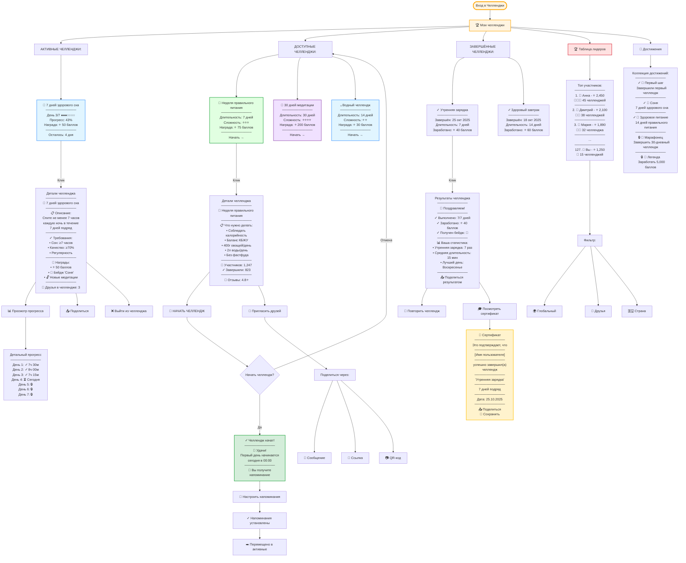
```mermaid
graph TB
    ChallengeEntry([Вход в Челленджи]) --> ChallengeMain["🏆 Мои челленджи"]
    
    ChallengeMain --> ActiveSection["АКТИВНЫЕ ЧЕЛЛЕНДЖИ:"]
    ChallengeMain --> AvailableSection["ДОСТУПНЫЕ ЧЕЛЛЕНДЖИ:"]
    ChallengeMain --> CompletedSection["ЗАВЕРШЁННЫЕ ЧЕЛЛЕНДЖИ:"]
    
    ActiveSection --> Active1["🌙 7 дней здорового сна<br/>─────────────<br/>День 3/7 ●●●○○○○<br/>Прогресс: 43%<br/>Награда: ⭐ 50 баллов<br/>─────────────<br/>Осталось: 4 дня"]
    
    Active1 -->|Клик| ChallengeDetails1["Детали челленджа<br/>─────────────<br/>🌙 7 дней здорового сна<br/>─────────────<br/>📋 Описание:<br/>Спите не менее 7 часов<br/>каждую ночь в течение<br/>7 дней подряд<br/>─────────────<br/>✓ Требования:<br/>• Сон: ≥7 часов<br/>• Качество: ≥70%<br/>• Регулярность<br/>─────────────<br/>🎁 Награды:<br/>• ⭐ 50 баллов<br/>• 🏅 Бейдж 'Соня'<br/>• 🔓 Новые медитации<br/>─────────────<br/>👥 Друзья в челлендже: 3"]
    
    ChallengeDetails1 --> ViewProgress["📊 Просмотр прогресса"]
    ChallengeDetails1 --> ShareProgress["📤 Поделиться"]
    ChallengeDetails1 --> QuitChallenge["❌ Выйти из челленджа"]
    
    ViewProgress --> ProgressScreen["Детальный прогресс<br/>─────────────<br/>День 1: ✓ 7ч 30м<br/>День 2: ✓ 8ч 00м<br/>День 3: ✓ 7ч 15м<br/>День 4: ⏳ Сегодня<br/>День 5: 🔒<br/>День 6: 🔒<br/>День 7: 🔒"]
    
    AvailableSection --> Available1["🍎 Неделя правильного питания<br/>─────────────<br/>Длительность: 7 дней<br/>Сложность: ⭐⭐⭐<br/>Награда: ⭐ 75 баллов<br/>─────────────<br/>Начать →"]
    
    AvailableSection --> Available2["🧘 30 дней медитации<br/>─────────────<br/>Длительность: 30 дней<br/>Сложность: ⭐⭐⭐⭐<br/>Награда: ⭐ 200 баллов<br/>─────────────<br/>Начать →"]
    
    AvailableSection --> Available3["💧 Водный челлендж<br/>─────────────<br/>Длительность: 14 дней<br/>Сложность: ⭐⭐<br/>Награда: ⭐ 30 баллов<br/>─────────────<br/>Начать →"]
    
    Available1 -->|Клик| AvailableDetails["Детали челленджа<br/>─────────────<br/>🍎 Неделя правильного питания<br/>─────────────<br/>📋 Что нужно делать:<br/>• Соблюдать калорийность<br/>• Баланс КБЖУ<br/>• 400г овощей/день<br/>• 2л воды/день<br/>• Без фастфуда<br/>─────────────<br/>👥 Участников: 1,247<br/>✓ Завершили: 823<br/>─────────────<br/>💬 Отзывы: 4.8⭐"]
    
    AvailableDetails --> StartChallengeBtn["🚀 НАЧАТЬ ЧЕЛЛЕНДЖ"]
    AvailableDetails --> InviteFriends["👥 Пригласить друзей"]
    
    StartChallengeBtn --> ConfirmStart{Начать челлендж?}
    ConfirmStart -->|Да| ChallengeStarted["✓ Челлендж начат!<br/>─────────────<br/>🎉 Удачи!<br/>Первый день начинается<br/>сегодня в 00:00<br/>─────────────<br/>📲 Вы получите<br/>напоминание"]
    ConfirmStart -->|Отмена| AvailableSection
    
    ChallengeStarted --> SetReminders["🔔 Настроить напоминания"]
    SetReminders --> ReminderSet["✓ Напоминания установлены"]
    ReminderSet --> MoveToActive["➡️ Перемещено в активные"]
    
    InviteFriends --> ShareOptions["Поделиться через:"]
    ShareOptions --> ShareMsg["📱 Сообщение"]
    ShareOptions --> ShareLink["🔗 Ссылка"]
    ShareOptions --> ShareQR["📷 QR-код"]
    
    CompletedSection --> Completed1["✓ Утренняя зарядка<br/>─────────────<br/>Завершён: 25 окт 2025<br/>Длительность: 7 дней<br/>Заработано: ⭐ 40 баллов"]
    
    CompletedSection --> Completed2["✓ Здоровый завтрак<br/>─────────────<br/>Завершён: 18 окт 2025<br/>Длительность: 14 дней<br/>Заработано: ⭐ 60 баллов"]
    
    Completed1 -->|Клик| CompletedDetails["Результаты челленджа<br/>─────────────<br/>🎉 Поздравляем!<br/>─────────────<br/>✓ Выполнено: 7/7 дней<br/>✓ Заработано: ⭐ 40 баллов<br/>✓ Получен бейдж: 🏅<br/>─────────────<br/>📊 Ваша статистика:<br/>• Утренняя зарядка: 7 раз<br/>• Средняя длительность: 15 мин<br/>• Лучший день: Воскресенье<br/>─────────────<br/>📤 Поделиться результатом"]
    
    CompletedDetails --> RepeatChallenge["🔄 Повторить челлендж"]
    CompletedDetails --> ViewCertificate["🎓 Посмотреть сертификат"]
    
    ViewCertificate --> Certificate["📜 Сертификат<br/>─────────────<br/>Это подтверждает, что<br/>─────────────<br/>[Имя пользователя]<br/>─────────────<br/>успешно завершил(а)<br/>челлендж<br/>─────────────<br/>'Утренняя зарядка'<br/>─────────────<br/>7 дней подряд<br/>─────────────<br/>Дата: 25.10.2025<br/>─────────────<br/>📤 Поделиться<br/>💾 Сохранить"]
    
    ChallengeMain --> Leaderboard["🏆 Таблица лидеров"]
    Leaderboard --> LeaderboardView["Топ участников:<br/>─────────────<br/>1. 👤 Анна - ⭐ 2,450<br/>   🏅🏅🏅 45 челленджей<br/>─────────────<br/>2. 👤 Дмитрий - ⭐ 2,100<br/>   🏅🏅 38 челленджей<br/>─────────────<br/>3. 👤 Мария - ⭐ 1,890<br/>   🏅🏅 32 челленджа<br/>─────────────<br/>...<br/>─────────────<br/>127. 👤 Вы - ⭐ 1,250<br/>    🏅 15 челленджей"]
    
    LeaderboardView --> FilterLeaderboard["Фильтр:"]
    FilterLeaderboard --> FilterGlobal["🌍 Глобальный"]
    FilterLeaderboard --> FilterFriends["👥 Друзья"]
    FilterLeaderboard --> FilterCountry["🇷🇺 Страна"]
    
    ChallengeMain --> Achievements["🏅 Достижения"]
    Achievements --> AchievementsList["Коллекция достижений:<br/>─────────────<br/>✓ 🏅 Первый шаг<br/>   Завершили первый челлендж<br/>─────────────<br/>✓ 🏅 Соня<br/>   7 дней здорового сна<br/>─────────────<br/>✓ 🏅 Здоровое питание<br/>   14 дней правильного питания<br/>─────────────<br/>🔒 🏅 Марафонец<br/>   Завершить 30-дневный челлендж<br/>─────────────<br/>🔒 🏅 Легенда<br/>   Заработать 5,000 баллов"]
    
    style ChallengeEntry fill:#fff4e1,stroke:#ffa500,stroke-width:3px
    style ChallengeMain fill:#fff4e1,stroke:#ffa500,stroke-width:2px
    style Active1 fill:#e1f5ff,stroke:#4a9eff,stroke-width:2px
    style Available1 fill:#e1ffe1,stroke:#28a745,stroke-width:2px
    style Available2 fill:#f0e1ff,stroke:#9b59b6,stroke-width:2px
    style Available3 fill:#e1f5ff,stroke:#4a9eff,stroke-width:2px
    style ChallengeStarted fill:#d4edda,stroke:#28a745,stroke-width:2px
    style Certificate fill:#fff3cd,stroke:#ffc107,stroke-width:2px
    style Leaderboard fill:#ffe1e1,stroke:#dc3545,stroke-width:2px
```

---

### 8. ДЫХАТЕЛЬНЫЕ ПРАКТИКИ И МЕДИТАЦИЯ - Детальный Flow

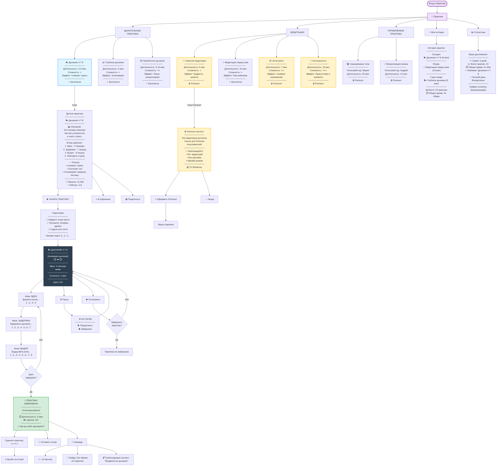
```mermaid
graph TB
    PracticeEntry([Вход в Практики]) --> PracticeMain["🧘 Практики"]
    
    PracticeMain --> BreathingSection["ДЫХАТЕЛЬНЫЕ ПРАКТИКИ:"]
    PracticeMain --> MeditationSection["МЕДИТАЦИИ:"]
    PracticeMain --> GuidedSection["УПРАВЛЯЕМЫЕ ПРАКТИКИ:"]
    
    BreathingSection --> Breath1["🌬️ Дыхание 4-7-8<br/>─────────────<br/>Длительность: 3-5 мин<br/>Сложность: ⭐<br/>Эффект: Снимает стресс<br/>─────────────<br/>✓ Бесплатно"]
    
    BreathingSection --> Breath2["🫁 Глубокое дыхание<br/>─────────────<br/>Длительность: 5 мин<br/>Сложность: ⭐<br/>Эффект: Успокаивает<br/>─────────────<br/>✓ Бесплатно"]
    
    BreathingSection --> Breath3["📦 Коробочное дыхание<br/>─────────────<br/>Длительность: 5-10 мин<br/>Сложность: ⭐⭐<br/>Эффект: Фокус, концентрация<br/>─────────────<br/>✓ Бесплатно"]
    
    MeditationSection --> Med1["🌅 Утренняя медитация<br/>─────────────<br/>Длительность: 5 мин<br/>Сложность: ⭐<br/>Эффект: Бодрость, энергия<br/>─────────────<br/>🔒 Premium"]
    
    MeditationSection --> Med2["🌙 Медитация перед сном<br/>─────────────<br/>Длительность: 10 мин<br/>Сложность: ⭐<br/>Эффект: Расслабление<br/>─────────────<br/>✓ Бесплатно"]
    
    MeditationSection --> Med3["😌 Антистресс<br/>─────────────<br/>Длительность: 7 мин<br/>Сложность: ⭐⭐<br/>Эффект: Снимает напряжение<br/>─────────────<br/>🔒 Premium"]
    
    MeditationSection --> Med4["🧘 Осознанность<br/>─────────────<br/>Длительность: 15 мин<br/>Сложность: ⭐⭐⭐<br/>Эффект: Присутствие в моменте<br/>─────────────<br/>🔒 Premium"]
    
    Breath1 -->|Клик| PracticeDetails["Детали практики<br/>─────────────<br/>🌬️ Дыхание 4-7-8<br/>─────────────<br/>� Описание:<br/>Эта техника помогает<br/>быстро успокоиться<br/>и снять стресс.<br/>─────────────<br/>⚙️ Как работает:<br/>1. Вдох - 4 секунды<br/>2. Задержка - 7 секунд<br/>3. Выдох - 8 секунд<br/>4. Повторить 4 раза<br/>─────────────<br/>✨ Польза:<br/>• Снижает стресс<br/>• Улучшает сон<br/>• Успокаивает нервную систему<br/>─────────────<br/>👥 Прошли: 12,453<br/>⭐ Рейтинг: 4.8"]
    
    PracticeDetails --> StartPracticeBtn["▶️ НАЧАТЬ ПРАКТИКУ"]
    PracticeDetails --> SaveToFavorites["⭐ В избранное"]
    PracticeDetails --> SharePractice["📤 Поделиться"]
    
    StartPracticeBtn --> PrepareScreen["Подготовка<br/>─────────────<br/>🧘 Найдите тихое место<br/>📱 Положите телефон удобно<br/>💺 Сядьте или лягте<br/>─────────────<br/>Начнём через: 3...2...1..."]
    
    PrepareScreen --> PracticeActive["🌬️ ДЫХАНИЕ 4-7-8<br/>─────────────<br/>[Анимация дыхания]<br/>     ⭕ ➡️ ⭕<br/>─────────────<br/>Вдох: 4 секунды<br/>●●●●<br/>─────────────<br/>Осталось: 3 мин<br/>─────────────<br/>Цикл: 2/4"]
    
    PracticeActive --> BreathPhase1["Фаза: ВДОХ<br/>Дышите носом...<br/>1...2...3...4"]
    BreathPhase1 --> BreathPhase2["Фаза: ЗАДЕРЖКА<br/>Задержите дыхание...<br/>1...2...3...4...5...6...7"]
    BreathPhase2 --> BreathPhase3["Фаза: ВЫДОХ<br/>Выдыхайте ртом...<br/>1...2...3...4...5...6...7...8"]
    BreathPhase3 --> CheckCycles{Цикл<br/>завершён?}
    CheckCycles -->|Нет| BreathPhase1
    CheckCycles -->|Да| PracticeComplete
    
    PracticeActive --> PauseBtn["⏸️ Пауза"]
    PracticeActive --> StopBtn["⏹️ Остановить"]
    
    PauseBtn --> PausedScreen["⏸️ НА ПАУЗЕ<br/>─────────────<br/>▶️ Продолжить<br/>⏹️ Завершить"]
    PausedScreen --> PracticeActive
    
    StopBtn --> ConfirmStop{Завершить<br/>практику?}
    ConfirmStop -->|Да| PracticeIncomplete["Практика не завершена"]
    ConfirmStop -->|Нет| PracticeActive
    
    PracticeComplete["🎉 ПРАКТИКА ЗАВЕРШЕНА!<br/>─────────────<br/>Отличная работа!<br/>─────────────<br/>⏱️ Длительность: 5 мин<br/>🌬️ Циклов: 4/4<br/>─────────────<br/>💭 Как вы себя чувствуете?"]
    
    PracticeComplete --> RatePractice["Оцените практику:<br/>⭐⭐⭐⭐⭐"]
    PracticeComplete --> LeaveFeedback["💬 Оставить отзыв"]
    PracticeComplete --> EarnReward["🎁 Награды"]
    
    EarnReward --> Points["⭐ +15 баллов"]
    EarnReward --> Badge["🏅 Бейдж 'Zen Master'<br/>(10 практик)"]
    EarnReward --> UnlockContent["🔓 Разблокирован контент:<br/>'Продвинутое дыхание'"]
    
    RatePractice --> ThankYou["Спасибо за отзыв!"]
    
    Med1 -->|Клик Premium| PremiumLock["🔒 Premium контент<br/>─────────────<br/>Эта медитация доступна<br/>только для Premium<br/>пользователей<br/>─────────────<br/>✨ Разблокируйте:<br/>• 50+ медитаций<br/>• Без рекламы<br/>• Офлайн режим<br/>─────────────<br/>💰 От $2/месяц"]
    
    PremiumLock --> UpgradeToPremium["⭐ Оформить Premium"]
    PremiumLock --> BackToPractices["← Назад"]
    
    UpgradeToPremium --> PremiumScreen["Экран подписки"]
    
    GuidedSection --> Guided1["🎧 Сканирование тела<br/>─────────────<br/>Голосовой гид: Мария<br/>Длительность: 20 мин<br/>─────────────<br/>🔒 Premium"]
    
    GuidedSection --> Guided2["🌊 Визуализация океана<br/>─────────────<br/>Голосовой гид: Андрей<br/>Длительность: 12 мин<br/>─────────────<br/>🔒 Premium"]
    
    PracticeMain --> MyHistory["📖 Моя история"]
    MyHistory --> HistoryList["История практик:<br/>─────────────<br/>Сегодня:<br/>🌬️ Дыхание 4-7-8 (5 мин)<br/>─────────────<br/>Вчера:<br/>🌙 Медитация перед сном (10 мин)<br/>─────────────<br/>3 дня назад:<br/>🌬️ Глубокое дыхание (5 мин)<br/>─────────────<br/>📊 Всего: 24 практики<br/>⏱️ Общее время: 3ч 45мин"]
    
    PracticeMain --> Stats["📊 Статистика"]
    Stats --> StatsView["Ваши достижения:<br/>─────────────<br/>🔥 Серия: 5 дней<br/>📈 Всего практик: 24<br/>⏱️ Общее время: 3ч 45м<br/>⭐ Любимая: Дыхание 4-7-8<br/>📅 Лучший день: Воскресенье<br/>─────────────<br/>График за месяц:<br/>[визуализация]"]
    
    style PracticeEntry fill:#f0e1ff,stroke:#9b59b6,stroke-width:3px
    style PracticeMain fill:#f0e1ff,stroke:#9b59b6,stroke-width:2px
    style Breath1 fill:#e1f5ff,stroke:#4a9eff,stroke-width:2px
    style Med1 fill:#fff3cd,stroke:#ffc107,stroke-width:2px
    style Med3 fill:#fff3cd,stroke:#ffc107,stroke-width:2px
    style Med4 fill:#fff3cd,stroke:#ffc107,stroke-width:2px
    style PracticeActive fill:#2c3e50,stroke:#1a252f,stroke-width:2px,color:#fff
    style PracticeComplete fill:#d4edda,stroke:#28a745,stroke-width:2px
    style PremiumLock fill:#fff3cd,stroke:#ffc107,stroke-width:2px
```

---

### 9. СТАТИСТИКА И ПРОГРЕСС - Детальная аналитика


```mermaid
graph TB
    StatsEntry([Вход в Статистику]) --> StatsMain["📊 Моя статистика"]
    
    StatsMain --> PeriodSelector["Период отображения:"]
    PeriodSelector --> Period1["� Сегодня"]
    PeriodSelector --> Period2["📅 Неделя (выбрано)"]
    PeriodSelector --> Period3["📅 Месяц"]
    PeriodSelector --> Period4["📅 Год"]
    PeriodSelector --> PeriodCustom["📅 Свой период"]
    
    Period2 --> StatsOverview["Обзор за неделю<br/>─────────────<br/>📊 Общий прогресс: 65%<br/>🔥 Серия: 7 дней<br/>⭐ Баллы: +180"]
    
    StatsOverview --> ActivityChart["График активности:<br/>─────────────<br/>Пн ████████░░ 80%<br/>Вт ██████░░░░ 60%<br/>Ср █████████░ 90%<br/>Чт ███████░░░ 70%<br/>Пт ████████░░ 80%<br/>Сб ██████████ 100%<br/>Вс █████████░ 90%<br/>─────────────<br/>Среднее: 81%"]
    
    StatsMain --> CategoryTabs["Категории:"]
    CategoryTabs --> TabSleep["🌙 Сон"]
    CategoryTabs --> TabNutrition["🍎 Питание"]
    CategoryTabs --> TabPractices["🧘 Практики"]
    CategoryTabs --> TabActivity["🏃 Активность"]
    CategoryTabs --> TabAll["📊 Всё"]
    
    TabSleep --> SleepStats["Статистика сна<br/>─────────────<br/>⏰ Среднее время:<br/>   7ч 15м<br/>📈 Изменение: +30м<br/>─────────────<br/>💤 Среднее качество:<br/>   78%<br/>📈 Изменение: +5%<br/>─────────────<br/>⭐ Лучшая ночь:<br/>   Суббота: 8ч 45м (95%)<br/>─────────────<br/>⚠️ Худшая ночь:<br/>   Вторник: 6ч 15м (65%)<br/>─────────────<br/>📈 Тренд: ↗️ Улучшение"]
    
    SleepStats --> SleepChart["График сна:<br/>[Интерактивный график]<br/>─────────────<br/>По дням недели<br/>По фазам сна<br/>По качеству"]
    
    SleepStats --> SleepInsights["💡 Инсайты AI:<br/>─────────────<br/>• Вы лучше спите<br/>  в выходные<br/>• Оптимальное время:<br/>  22:30 - 06:30<br/>• Качество выше при<br/>  ужине до 20:00"]
    
    TabNutrition --> NutritionStats["Статистика питания<br/>─────────────<br/>🔥 Среднее потребление:<br/>   1,850 ккал/день<br/>🎯 Цель: 2,000 ккал<br/>📉 Дефицит: -150 ккал<br/>─────────────<br/>⚖️ Баланс КБЖУ:<br/>   Белки: 80г ✓<br/>   Углеводы: 190г ✓<br/>   Жиры: 60г ✓<br/>─────────────<br/>💧 Вода: 1.8л/день<br/>🎯 Цель: 2л<br/>─────────────<br/>📈 Тренд: ➡️ Стабильно"]
    
    NutritionStats --> MacroChart["Круговая диаграмма:<br/>─────────────<br/>🟦 Белки: 35%<br/>🟩 Углеводы: 45%<br/>🟧 Жиры: 20%"]
    
    NutritionStats --> TopFoods["🏆 Топ продуктов:<br/>─────────────<br/>1. Овсянка (7 раз)<br/>2. Куриная грудка (6 раз)<br/>3. Гречка (5 раз)<br/>4. Яблоко (8 раз)<br/>5. Молоко (7 раз)"]
    
    NutritionStats --> MealAnalysis["📊 Анализ приёмов:<br/>─────────────<br/>🌅 Завтрак: 450 ккал<br/>☀️ Обед: 700 ккал<br/>🌆 Ужин: 550 ккал<br/>🍎 Перекусы: 150 ккал"]
    
    TabPractices --> PracticeStats["Статистика практик<br/>─────────────<br/>🧘 Всего сессий: 12<br/>🎯 Цель: 14/неделю<br/>📉 Осталось: 2<br/>─────────────<br/>⏱️ Общее время:<br/>   1ч 45м<br/>⏰ Среднее время:<br/>   9 минут/сессия<br/>─────────────<br/>🔥 Серия: 5 дней<br/>🏆 Лучшая серия: 12 дней<br/>─────────────<br/>📈 Тренд: ↗️ Улучшение"]
    
    PracticeStats --> PracticeTypes["Типы практик:<br/>─────────────<br/>🌬️ Дыхательные: 7 (58%)<br/>🧘 Медитации: 5 (42%)<br/>─────────────<br/>⭐ Любимая:<br/>   Дыхание 4-7-8"]
    
    PracticeStats --> TimeDist["Распределение по времени:<br/>─────────────<br/>🌅 Утро: 3 сессии<br/>☀️ День: 2 сессии<br/>🌆 Вечер: 7 сессий"]
    
    TabActivity --> ActivityStats["Статистика активности<br/>─────────────<br/>🏃 Средние шаги:<br/>   8,500/день<br/>🎯 Цель: 10,000<br/>📉 До цели: 1,500<br/>─────────────<br/>🔥 Сожжено калорий:<br/>   450 ккал/день<br/>─────────────<br/>📏 Дистанция:<br/>   6.5 км/день<br/>─────────────<br/>⏱️ Активное время:<br/>   45 минут/день"]
    
    ActivityStats --> ActivityChart2["График активности<br/>[Столбчатая диаграмма]"]
    
    TabAll --> AllStats["Сводная статистика<br/>─────────────<br/>📊 Все категории"]
    
    StatsMain --> Achievements["� Достижения"]
    Achievements --> AchievementGrid["Коллекция достижений:<br/>─────────────<br/>✓ 🏅 Первый шаг<br/>✓ 🏅 Соня (7 дней сна)<br/>✓ 🏅 Здоровое питание<br/>✓ 🏅 Zen Master (10 практик)<br/>✓ 🏅 Гидратация (14 дней воды)<br/>─────────────<br/>🔒 🏅 Марафонец<br/>🔒 🏅 Легенда<br/>🔒 🏅 Гуру здоровья"]
    
    StatsMain --> Leaderboard["🏆 Рейтинг"]
    Leaderboard --> Rankings["Таблица лидеров:<br/>─────────────<br/>🌍 Глобальный:<br/>   Место: 127/10,453<br/>─────────────<br/>👥 Среди друзей:<br/>   Место: 3/8<br/>─────────────<br/>🇷🇺 По стране:<br/>   Место: 45/3,287"]
    
    StatsMain --> DetailedReport["📄 Подробный отчёт"]
    DetailedReport --> ReportOptions["Создать отчёт:<br/>─────────────<br/>📅 Период:<br/>   • За неделю<br/>   • За месяц<br/>   • За год<br/>   • Свой период<br/>─────────────<br/>📊 Включить:<br/>   ☑️ Сон<br/>   ☑️ Питание<br/>   ☑️ Практики<br/>   ☑️ Активность<br/>   ☑️ Достижения"]
    
    ReportOptions --> GenerateReport["⚙️ Сгенерировать"]
    GenerateReport --> ReportReady["✓ Отчёт готов!<br/>─────────────<br/>📄 Формат: PDF<br/>📊 Страниц: 12<br/>📅 Период: 01-31 окт<br/>─────────────<br/>📤 Экспорт:<br/>• Email<br/>• Сохранить<br/>• Поделиться"]
    
    StatsMain --> AIAnalysisStats["🤖 AI Анализ"]
    AIAnalysisStats --> Insights["Инсайты и рекомендации:<br/>─────────────<br/>📊 Общий анализ:<br/>'Ваш прогресс отличный!<br/>Вы на 15% лучше<br/>среднестатистического<br/>пользователя.'<br/>─────────────<br/>✨ Сильные стороны:<br/>• Регулярность сна<br/>• Баланс питания<br/>─────────────<br/>⚠️ Области для улучшения:<br/>• Увеличить активность<br/>• Больше практик<br/>─────────────<br/>🎯 Рекомендации:<br/>• Добавьте вечернюю<br/>  медитацию<br/>• Цель: 10,000 шагов"]
    
    style StatsEntry fill:#e1f5ff,stroke:#4a9eff,stroke-width:3px
    style StatsMain fill:#fff4e1,stroke:#ffa500,stroke-width:2px
    style AIAnalysisStats fill:#f0e1ff,stroke:#9b59b6,stroke-width:2px
    style ReportReady fill:#d4edda,stroke:#28a745,stroke-width:2px
    style SleepStats fill:#e1f0ff,stroke:#4a9eff,stroke-width:2px
    style NutritionStats fill:#e1ffe1,stroke:#28a745,stroke-width:2px
    style PracticeStats fill:#f0e1ff,stroke:#9b59b6,stroke-width:2px
    style ActivityStats fill:#ffe1e1,stroke:#dc3545,stroke-width:2px
```

---

### 10. PREMIUM ПОДПИСКА - Детальный платёжный flow

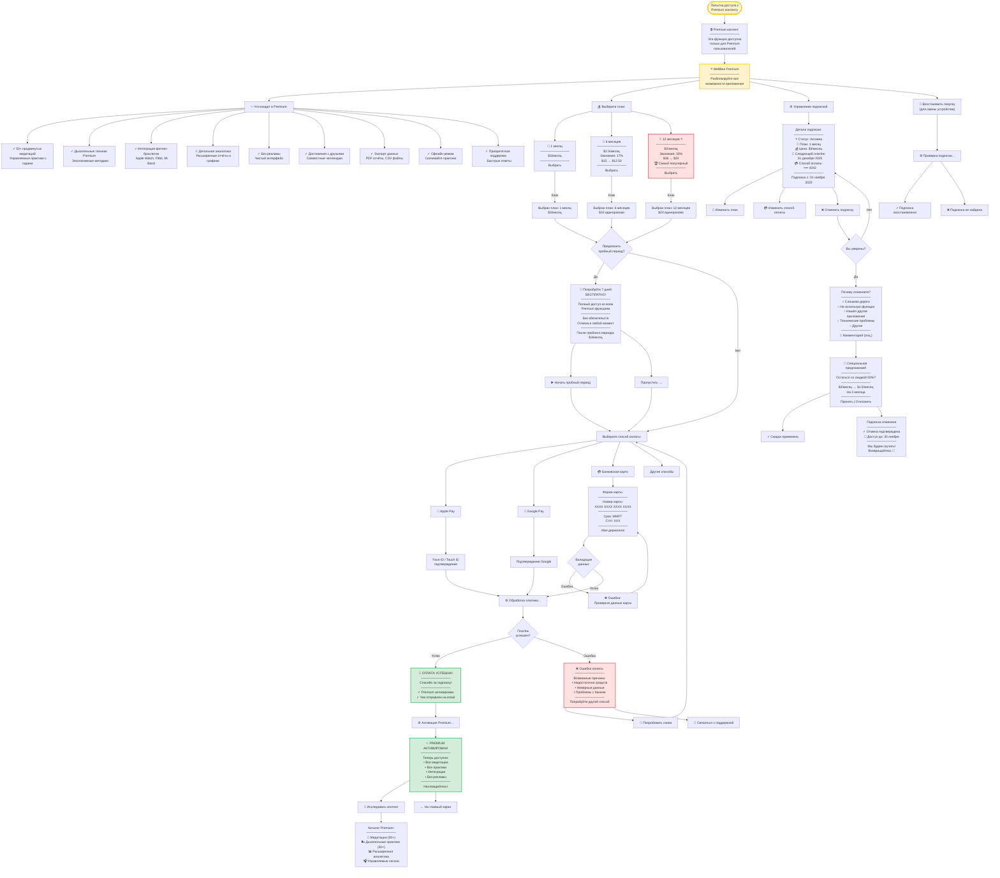
```mermaid
graph TB
    PremiumEntry([Попытка доступа к<br/>Premium контенту]) --> PaywallScreen["🔒 Premium контент<br/>─────────────<br/>Эта функция доступна<br/>только для Premium<br/>пользователей"]
    
    PaywallScreen --> PremiumMain["⭐ WellBee Premium<br/>─────────────<br/>Разблокируйте все<br/>возможности приложения"]
    
    PremiumMain --> Features["✨ Что входит в Premium:"]
    Features --> Feature1["✓ 50+ продвинутых медитаций<br/>  Управляемые практики с гидами"]
    Features --> Feature2["✓ Дыхательные техники Premium<br/>  Эксклюзивные методики"]
    Features --> Feature3["✓ Интеграция фитнес-браслетов<br/>  Apple Watch, Fitbit, Mi Band"]
    Features --> Feature4["✓ Детальная аналитика<br/>  Расширенные отчёты и графики"]
    Features --> Feature5["✓ Без рекламы<br/>  Чистый интерфейс"]
    Features --> Feature6["✓ Достижения с друзьями<br/>  Совместные челленджи"]
    Features --> Feature7["✓ Экспорт данных<br/>  PDF отчёты, CSV файлы"]
    Features --> Feature8["✓ Офлайн режим<br/>  Скачивайте практики"]
    Features --> Feature9["✓ Приоритетная поддержка<br/>  Быстрые ответы"]
    
    PremiumMain --> Plans["💰 Выберите план:"]
    
    Plans --> Plan1["📅 1 месяц<br/>─────────────<br/>$3/месяц<br/>─────────────<br/>Выбрать"]
    Plans --> Plan2["📅 6 месяцев<br/>─────────────<br/>$2.5/месяц<br/>Экономия: 17%<br/>$15 → $12.50<br/>─────────────<br/>Выбрать"]
    Plans --> Plan3["📅 12 месяцев ⭐<br/>─────────────<br/>$2/месяц<br/>Экономия: 33%<br/>$36 → $24<br/>🏆 Самый популярный<br/>─────────────<br/>Выбрать"]
    
    Plan1 -->|Клик| PlanSelected1
    Plan2 -->|Клик| PlanSelected2
    Plan3 -->|Клик| PlanSelected3
    
    PlanSelected1["Выбран план: 1 месяц<br/>$3/месяц"]
    PlanSelected2["Выбран план: 6 месяцев<br/>$15 единоразово"]
    PlanSelected3["Выбран план: 12 месяцев<br/>$24 единоразово"]
    
    PlanSelected1 --> TrialOffer
    PlanSelected2 --> TrialOffer
    PlanSelected3 --> TrialOffer
    
    TrialOffer{Предложить<br/>пробный период?}
    TrialOffer -->|Да| TrialScreen["🎁 Попробуйте 7 дней<br/>БЕСПЛАТНО!<br/>─────────────<br/>Полный доступ ко всем<br/>Premium функциям<br/>─────────────<br/>Без обязательств<br/>Отмена в любой момент<br/>─────────────<br/>После пробного периода:<br/>$3/месяц"]
    TrialOffer -->|Нет| PaymentMethod
    
    TrialScreen --> StartTrial["▶️ Начать пробный период"]
    TrialScreen --> SkipTrial["Пропустить →"]
    
    StartTrial --> PaymentMethod
    SkipTrial --> PaymentMethod
    
    PaymentMethod["Выберите способ оплаты:"]
    PaymentMethod --> ApplePay["🍎 Apple Pay"]
    PaymentMethod --> GooglePay["🔵 Google Pay"]
    PaymentMethod --> Card["💳 Банковская карта"]
    PaymentMethod --> Other["Другие способы"]
    
    ApplePay --> AppleAuth["Face ID / Touch ID<br/>подтверждение"]
    GooglePay --> GoogleAuth["Подтверждение Google"]
    Card --> CardForm["Форма карты:<br/>─────────────<br/>Номер карты:<br/>XXXX XXXX XXXX XXXX<br/>─────────────<br/>Срок: ММ/ГГ<br/>CVV: XXX<br/>─────────────<br/>Имя держателя"]
    
    AppleAuth --> Processing
    GoogleAuth --> Processing
    CardForm --> CardValidation{Валидация<br/>данных}
    CardValidation -->|Ошибка| CardError["❌ Ошибка:<br/>Проверьте данные карты"]
    CardError --> CardForm
    CardValidation -->|Успех| Processing
    
    Processing["⚙️ Обработка платежа..."]
    Processing --> PaymentCheck{Платёж<br/>успешен?}
    
    PaymentCheck -->|Успех| PaymentSuccess["🎉 ОПЛАТА УСПЕШНА!<br/>─────────────<br/>Спасибо за подписку!<br/>─────────────<br/>✓ Premium активирован<br/>✓ Чек отправлен на email"]
    PaymentCheck -->|Ошибка| PaymentError["❌ Ошибка оплаты<br/>─────────────<br/>Возможные причины:<br/>• Недостаточно средств<br/>• Неверные данные<br/>• Проблемы с банком<br/>─────────────<br/>Попробуйте другой способ"]
    
    PaymentError --> RetryPayment["🔄 Попробовать снова"]
    PaymentError --> ContactSupport["💬 Связаться с поддержкой"]
    RetryPayment --> PaymentMethod
    
    PaymentSuccess --> ActivatePremium["⚙️ Активация Premium..."]
    ActivatePremium --> PremiumActivated["✨ PREMIUM АКТИВИРОВАН!<br/>─────────────<br/>Теперь доступно:<br/>• Все медитации<br/>• Все практики<br/>• Интеграции<br/>• Без рекламы<br/>─────────────<br/>Наслаждайтесь!"]
    
    PremiumActivated --> ExploreContent["🚀 Исследовать контент"]
    PremiumActivated --> BackToDashboard["← На главный экран"]
    
    ExploreContent --> PremiumCatalog["Каталог Premium:<br/>─────────────<br/>🧘 Медитации (50+)<br/>🌬️ Дыхательные практики (30+)<br/>📊 Расширенная аналитика<br/>🎧 Управляемые сессии"]
    
    PremiumMain --> ManageSub["⚙️ Управление подпиской"]
    ManageSub --> SubDetails["Детали подписки:<br/>─────────────<br/>⭐ Статус: Активна<br/>📅 План: 1 месяц<br/>💰 Цена: $3/месяц<br/>📆 Следующий платёж:<br/>   01 декабря 2025<br/>💳 Способ оплаты:<br/>   •••• 4242<br/>─────────────<br/>Подписка с: 01 ноября 2025"]
    
    SubDetails --> ChangePlan["📝 Изменить план"]
    SubDetails --> UpdatePayment["💳 Изменить способ оплаты"]
    SubDetails --> CancelSub["❌ Отменить подписку"]
    
    CancelSub --> CancelConfirm{Вы уверены?}
    CancelConfirm -->|Да| CancelFeedback["Почему отменяете?<br/>─────────────<br/>○ Слишком дорого<br/>○ Не использую функции<br/>○ Нашёл другое приложение<br/>○ Технические проблемы<br/>○ Другое<br/>─────────────<br/>💬 Комментарий (опц.)"]
    CancelConfirm -->|Нет| SubDetails
    
    CancelFeedback --> OfferDiscount["🎁 Специальное предложение!<br/>─────────────<br/>Остаться со скидкой 50%?<br/>─────────────<br/>$3/месяц → $1.5/месяц<br/>На 3 месяца<br/>─────────────<br/>Принять | Отклонить"]
    
    OfferDiscount --> AcceptDiscount["✓ Скидка применена"]
    OfferDiscount --> FinalCancel["Подписка отменена<br/>─────────────<br/>✓ Отмена подтверждена<br/>📅 Доступ до: 30 ноября<br/>─────────────<br/>Мы будем скучать!<br/>Возвращайтесь 💙"]
    
    PremiumMain --> RestorePurchase["🔄 Восстановить покупку<br/>(для смены устройства)"]
    RestorePurchase --> RestoreCheck["⚙️ Проверка подписки..."]
    RestoreCheck --> RestoreSuccess["✓ Подписка восстановлена!"]
    RestoreCheck --> RestoreError["❌ Подписка не найдена"]
    
    style PremiumEntry fill:#fff3cd,stroke:#ffc107,stroke-width:3px
    style PremiumMain fill:#fff3cd,stroke:#ffc107,stroke-width:2px
    style Plan3 fill:#ffe1e1,stroke:#dc3545,stroke-width:2px
    style PaymentSuccess fill:#d4edda,stroke:#28a745,stroke-width:2px
    style PremiumActivated fill:#d4edda,stroke:#28a745,stroke-width:2px
    style PaymentError fill:#ffe1e1,stroke:#dc3545,stroke-width:2px
```

---

### 11. СОЦИАЛЬНЫЕ ФУНКЦИИ И ДРУЗЬЯ - Детальный Flow

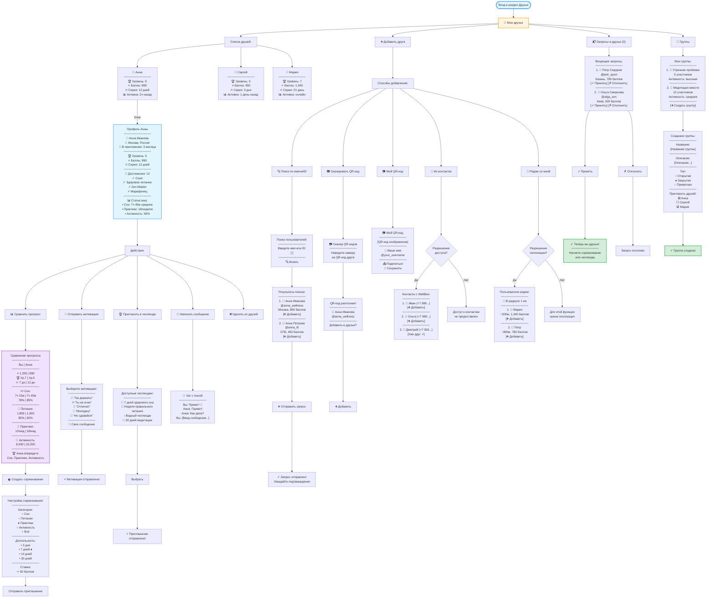
```mermaid
graph TB
    SocialEntry([Вход в раздел Друзья]) --> FriendsMain["👥 Мои друзья"]
    
    FriendsMain --> FriendsList["Список друзей:"]
    FriendsList --> Friend1["👤 Анна<br/>─────────────<br/>🏆 Уровень: 5<br/>⭐ Баллы: 890<br/>🔥 Серия: 12 дней<br/>📊 Активна: 2ч назад"]
    FriendsList --> Friend2["👤 Сергей<br/>─────────────<br/>🏆 Уровень: 3<br/>⭐ Баллы: 450<br/>🔥 Серия: 3 дня<br/>📊 Активен: 1 день назад"]
    FriendsList --> Friend3["👤 Мария<br/>─────────────<br/>🏆 Уровень: 7<br/>⭐ Баллы: 1,340<br/>🔥 Серия: 21 день<br/>📊 Активна: онлайн"]
    
    Friend1 -->|Клик| FriendProfile["Профиль Анны<br/>─────────────<br/>👤 Анна Иванова<br/>📍 Москва, Россия<br/>📅 В приложении: 3 месяца<br/>─────────────<br/>🏆 Уровень: 5<br/>⭐ Баллы: 890<br/>🔥 Серия: 12 дней<br/>─────────────<br/>🏅 Достижения: 12<br/>✓ Соня<br/>✓ Здоровое питание<br/>✓ Zen Master<br/>✓ Марафонец<br/>─────────────<br/>📊 Статистика:<br/>• Сон: 7ч 45м среднее<br/>• Практики: 18/неделю<br/>• Активность: 95%"]
    
    FriendProfile --> ProfileActions["Действия:"]
    ProfileActions --> CompareProgress["📊 Сравнить прогресс"]
    ProfileActions --> SendMotivation["💪 Отправить мотивацию"]
    ProfileActions --> InviteChallenge["🏆 Пригласить в челлендж"]
    ProfileActions --> SendMessage["💬 Написать сообщение"]
    ProfileActions --> RemoveFriend["❌ Удалить из друзей"]
    
    CompareProgress --> ComparisonScreen["Сравнение прогресса<br/>─────────────<br/>      Вы    |   Анна<br/>─────────────<br/>⭐ 1,250 | 890<br/>🏆 Ур.7  | Ур.5<br/>🔥 7 дн  | 12 дн<br/>─────────────<br/>💤 Сон:<br/>  7ч 15м | 7ч 45м<br/>  78%    | 85%<br/>─────────────<br/>🍎 Питание:<br/>  1,850  | 1,920<br/>  85%    | 92%<br/>─────────────<br/>🧘 Практики:<br/>  12/нед | 18/нед<br/>─────────────<br/>🏃 Активность:<br/>  8,500  | 10,200<br/>─────────────<br/>🏆 Анна впереди в:<br/>  Сон, Практики, Активность"]
    
    ComparisonScreen --> CreateCompetition["� Создать соревнование"]
    CreateCompetition --> CompetitionSetup["Настройка соревнования:<br/>─────────────<br/>Категория:<br/>○ Сон<br/>○ Питание<br/>● Практики<br/>○ Активность<br/>○ Всё<br/>─────────────<br/>Длительность:<br/>• 3 дня<br/>• 7 дней ●<br/>• 14 дней<br/>• 30 дней<br/>─────────────<br/>Ставка:<br/>⭐ 50 баллов"]
    CompetitionSetup --> SendInvite["Отправить приглашение"]
    
    SendMotivation --> MotivationOptions["Выберите мотивацию:<br/>─────────────<br/>💪 'Так держать!'<br/>🔥 'Ты на огне!'<br/>🌟 'Отлично!'<br/>👏 'Молодец!'<br/>🎯 'Не сдавайся!'<br/>─────────────<br/>💬 Свое сообщение"]
    MotivationOptions --> MotivationSent["✓ Мотивация отправлена!"]
    
    InviteChallenge --> ChallengeList["Доступные челленджи:<br/>─────────────<br/>🌙 7 дней здорового сна<br/>🍎 Неделя правильного питания<br/>💧 Водный челлендж<br/>🧘 30 дней медитации"]
    ChallengeList --> SelectChallenge["Выбрать"]
    SelectChallenge --> InviteSent["✓ Приглашение отправлено!"]
    
    SendMessage --> ChatScreen["💬 Чат с Анной<br/>─────────────<br/>Вы: Привет! 👋<br/>Анна: Привет!<br/>Анна: Как дела?<br/>Вы: [Ввод сообщения...]"]
    
    FriendsMain --> AddFriendBtn["➕ Добавить друга"]
    AddFriendBtn --> AddFriendMethods["Способы добавления:"]
    AddFriendMethods --> SearchByName["🔍 Поиск по имени/ID"]
    AddFriendMethods --> ScanQR["📷 Сканировать QR-код"]
    AddFriendMethods --> MyQR["📷 Мой QR-код"]
    AddFriendMethods --> FromContacts["📱 Из контактов"]
    AddFriendMethods --> NearbyUsers["📍 Рядом со мной"]
    
    SearchByName --> SearchForm["Поиск пользователей:<br/>─────────────<br/>Введите имя или ID:<br/>[         ]<br/>─────────────<br/>🔍 Искать"]
    SearchForm --> SearchResults["Результаты поиска:<br/>─────────────<br/>1. 👤 Анна Иванова<br/>   @anna_wellness<br/>   Москва, 890 баллов<br/>   [➕ Добавить]<br/>─────────────<br/>2. 👤 Анна Петрова<br/>   @anna_fit<br/>   СПб, 450 баллов<br/>   [➕ Добавить]"]
    
    SearchResults --> SendRequest["➕ Отправить запрос"]
    SendRequest --> RequestSent["✓ Запрос отправлен!<br/>Ожидайте подтверждения"]
    
    ScanQR --> QRScanner["📷 Сканер QR-кодов<br/>─────────────<br/>Наведите камеру<br/>на QR-код друга"]
    QRScanner --> QRDetected["QR-код распознан!<br/>─────────────<br/>👤 Анна Иванова<br/>@anna_wellness<br/>─────────────<br/>Добавить в друзья?"]
    QRDetected --> AddFromQR["➕ Добавить"]
    
    MyQR --> ShowMyQR["📷 Мой QR-код<br/>─────────────<br/>[QR-код изображение]<br/>─────────────<br/>👤 Ваше имя<br/>@your_username<br/>─────────────<br/>📤 Поделиться<br/>💾 Сохранить"]
    
    FromContacts --> ContactsAccess{Разрешение<br/>доступа?}
    ContactsAccess -->|Да| ContactsList["Контакты с WellBee:<br/>─────────────<br/>1. 👤 Иван (+7 999...)<br/>   [➕ Добавить]<br/>─────────────<br/>2. 👤 Ольга (+7 985...)<br/>   [➕ Добавить]<br/>─────────────<br/>3. 👤 Дмитрий (+7 926...)<br/>   [Уже друг ✓]"]
    ContactsAccess -->|Нет| AccessDenied["Доступ к контактам<br/>не предоставлен"]
    
    NearbyUsers --> LocationPermission{Разрешение<br/>геолокации?}
    LocationPermission -->|Да| NearbyList["Пользователи рядом:<br/>─────────────<br/>📍 В радиусе 1 км<br/>─────────────<br/>1. 👤 Мария<br/>   ~500м, 1,340 баллов<br/>   [➕ Добавить]<br/>─────────────<br/>2. 👤 Петр<br/>   ~800м, 780 баллов<br/>   [➕ Добавить]"]
    LocationPermission -->|Нет| LocationDenied["Для этой функции<br/>нужна геолокация"]
    
    FriendsMain --> FriendRequests["📬 Запросы в друзья (3)"]
    FriendRequests --> RequestsList["Входящие запросы:<br/>─────────────<br/>1. 👤 Петр Сидоров<br/>   @petr_sport<br/>   Казань, 780 баллов<br/>   [✓ Принять] [✗ Отклонить]<br/>─────────────<br/>2. 👤 Ольга Смирнова<br/>   @olga_zen<br/>   Киев, 920 баллов<br/>   [✓ Принять] [✗ Отклонить]"]
    
    RequestsList --> AcceptRequest["✓ Принять"]
    RequestsList --> DeclineRequest["✗ Отклонить"]
    
    AcceptRequest --> FriendAdded["✓ Теперь вы друзья!<br/>─────────────<br/>Начните соревнование<br/>или челлендж"]
    DeclineRequest --> RequestDeclined["Запрос отклонён"]
    
    FriendsMain --> Groups["👥 Группы"]
    Groups --> GroupsList["Мои группы:<br/>─────────────<br/>1. 🏃 Утренние пробежки<br/>   5 участников<br/>   Активность: высокая<br/>─────────────<br/>2. 🧘 Медитация вместе<br/>   12 участников<br/>   Активность: средняя<br/>─────────────<br/>[➕ Создать группу]"]
    
    GroupsList --> CreateGroup["Создание группы:<br/>─────────────<br/>Название:<br/>[Название группы]<br/>─────────────<br/>Описание:<br/>[Описание...]<br/>─────────────<br/>Тип:<br/>○ Открытая<br/>● Закрытая<br/>○ Приватная<br/>─────────────<br/>Пригласить друзей:<br/>☑️ Анна<br/>☐ Сергей<br/>☑️ Мария"]
    CreateGroup --> GroupCreated["✓ Группа создана!"]
    
    style SocialEntry fill:#e1f5ff,stroke:#4a9eff,stroke-width:3px
    style FriendsMain fill:#fff4e1,stroke:#ffa500,stroke-width:2px
    style FriendProfile fill:#e1f5ff,stroke:#4a9eff,stroke-width:2px
    style ComparisonScreen fill:#f0e1ff,stroke:#9b59b6,stroke-width:2px
    style FriendAdded fill:#d4edda,stroke:#28a745,stroke-width:2px
    style GroupCreated fill:#d4edda,stroke:#28a745,stroke-width:2px
```

---

### 12. ИНТЕГРАЦИИ С УСТРОЙСТВАМИ - Детальный Flow


```mermaid
graph TB
    IntegrationEntry([Профиль → Настройки<br/>→ Интеграции]) --> IntegrationMain["🔗 Интеграции<br/>─────────────<br/>Подключите устройства<br/>для автоматической<br/>синхронизации данных"]
    
    IntegrationMain --> PremiumCheck{Premium<br/>активен?}
    PremiumCheck -->|Нет| PremiumRequired["🔒 Premium функция<br/>─────────────<br/>Интеграции доступны<br/>только для Premium<br/>пользователей<br/>─────────────<br/>Разблокируйте:<br/>• Apple Watch<br/>• Fitbit<br/>• Google Fit<br/>• Mi Band<br/>• Samsung Health<br/>─────────────<br/>⭐ Оформить Premium"]
    PremiumCheck -->|Да| DevicesList
    
    PremiumRequired --> UpgradePremium["Переход к подписке"]
    
    DevicesList["Доступные интеграции:"]
    DevicesList --> AppleWatch["⌚ Apple Watch<br/>─────────────<br/>Статус: Не подключено<br/>─────────────<br/>Данные:<br/>• Сон<br/>• Активность<br/>• Пульс<br/>• Калории<br/>─────────────<br/>[Подключить]"]
    
    DevicesList --> Fitbit["⌚ Fitbit<br/>─────────────<br/>Статус: Подключено ✓<br/>─────────────<br/>Последняя синхронизация:<br/>2 часа назад<br/>─────────────<br/>Данные:<br/>• Сон: ✓<br/>• Шаги: ✓<br/>• Пульс: ✓<br/>─────────────<br/>[Настроить] [Отключить]"]
    
    DevicesList --> GoogleFit["🏃 Google Fit<br/>─────────────<br/>Статус: Не подключено<br/>─────────────<br/>Данные:<br/>• Активность<br/>• Шаги<br/>• Калории<br/>─────────────<br/>[Подключить]"]
    
    DevicesList --> MiBand["🩺 Mi Band<br/>─────────────<br/>Статус: Не подключено<br/>─────────────<br/>Данные:<br/>• Сон<br/>• Шаги<br/>• Пульс<br/>─────────────<br/>[Подключить]"]
    
    DevicesList --> SamsungHealth["📱 Samsung Health<br/>─────────────<br/>Статус: Не подключено<br/>─────────────<br/>Данные:<br/>• Активность<br/>• Питание<br/>• Сон<br/>─────────────<br/>[Подключить]"]
    
    AppleWatch -->|Клик| AppleWatchSetup["Подключение Apple Watch<br/>─────────────<br/>1️⃣ Откройте приложение<br/>   Health на iPhone<br/>─────────────<br/>2️⃣ Разрешите доступ<br/>   к данным:<br/>   ☐ Сон<br/>   ☐ Активность<br/>   ☐ Пульс<br/>   ☐ Калории<br/>─────────────<br/>3️⃣ Подтвердите<br/>   синхронизацию"]
    
    AppleWatchSetup --> AppleHealthAuth["Запрос доступа<br/>Apple Health<br/>─────────────<br/>WellBee запрашивает<br/>разрешение на чтение:<br/>─────────────<br/>☑️ Сон<br/>☑️ Шаги<br/>☑️ Пульс<br/>☑️ Калории<br/>☑️ Активные минуты<br/>─────────────<br/>[Разрешить] [Отмена]"]
    
    AppleHealthAuth --> ConnectingApple["⚙️ Подключение..."]
    ConnectingApple --> AppleConnected["✓ Apple Watch подключены!<br/>─────────────<br/>Синхронизация начата<br/>─────────────<br/>Данные будут автоматически<br/>загружаться каждые 15 минут"]
    
    GoogleFit -->|Клик| GoogleFitSetup["Подключение Google Fit<br/>─────────────<br/>Вы будете перенаправлены<br/>для авторизации<br/>─────────────<br/>[Продолжить]"]
    
    GoogleFitSetup --> GoogleAuth["Вход в Google<br/>─────────────<br/>Выберите аккаунт:<br/>─────────────<br/>○ user@gmail.com<br/>○ other@gmail.com<br/>○ Добавить аккаунт"]
    
    GoogleAuth --> GooglePermissions["Разрешения Google Fit<br/>─────────────<br/>WellBee запрашивает<br/>доступ к:<br/>─────────────<br/>☑️ Активность<br/>☑️ Расположение<br/>☑️ Данные о теле<br/>─────────────<br/>[Разрешить] [Отклонить]"]
    
    GooglePermissions --> ConnectingGoogle["⚙️ Подключение..."]
    ConnectingGoogle --> GoogleConnected["✓ Google Fit подключен!<br/>─────────────<br/>Данные синхронизированы"]
    
    MiBand -->|Клик| MiBandSetup["Подключение Mi Band<br/>─────────────<br/>Требования:<br/>• Mi Fit установлен<br/>• Mi Band сопряжен<br/>─────────────<br/>Как подключить:<br/>1. Откройте Mi Fit<br/>2. Профиль → Настройки<br/>3. Разрешить доступ<br/>─────────────<br/>[Продолжить]"]
    
    MiBandSetup --> MiFitAuth["Авторизация Mi Fit<br/>─────────────<br/>Введите данные Mi аккаунта:<br/>─────────────<br/>Email/Телефон:<br/>[           ]<br/>─────────────<br/>Пароль:<br/>[           ]<br/>─────────────<br/>[Войти]"]
    
    MiFitAuth --> MiBandPermissions["Разрешения Mi Fit<br/>─────────────<br/>☑️ Данные сна<br/>☑️ Шаги<br/>☑️ Пульс<br/>☑️ История активности<br/>─────────────<br/>[Разрешить]"]
    
    MiBandPermissions --> ConnectingMiBand["⚙️ Подключение..."]
    ConnectingMiBand --> MiBandConnected["✓ Mi Band подключен!"]
    
    Fitbit -->|Настроить| FitbitSettings["Настройки Fitbit<br/>─────────────<br/>⚙️ Параметры синхронизации:<br/>─────────────<br/>Что синхронизировать:<br/>☑️ Сон<br/>☑️ Шаги<br/>☑️ Пульс<br/>☑️ Калории<br/>☐ Питание<br/>─────────────<br/>Частота синхронизации:<br/>● Автоматически<br/>○ Вручную<br/>─────────────<br/>Последняя синхронизация:<br/>2 часа назад<br/>─────────────<br/>[Синхронизировать сейчас]<br/>[Сохранить]"]
    
    FitbitSettings --> SyncNow["⚙️ Синхронизация..."]
    SyncNow --> SyncComplete["✓ Синхронизировано!<br/>─────────────<br/>Получены данные:<br/>• Сон: 7ч 30м<br/>• Шаги: 8,742<br/>• Калории: 456 ккал<br/>• Пульс: 72 уд/мин"]
    
    Fitbit -->|Отключить| DisconnectConfirm{Отключить<br/>устройство?}
    DisconnectConfirm -->|Да| Disconnected["✓ Fitbit отключен<br/>─────────────<br/>Данные больше не будут<br/>синхронизироваться<br/>─────────────<br/>Локальные данные сохранены"]
    DisconnectConfirm -->|Нет| FitbitSettings
    
    IntegrationMain --> SyncStatus["📊 Статус синхронизации"]
    SyncStatus --> SyncHistory["История синхронизации:<br/>─────────────<br/>Сегодня, 14:30<br/>✓ Fitbit - Успешно<br/>  Получено: Сон, Шаги<br/>─────────────<br/>Сегодня, 12:15<br/>✓ Fitbit - Успешно<br/>  Получено: Активность<br/>─────────────<br/>Вчера, 23:45<br/>❌ Fitbit - Ошибка<br/>  Нет подключения<br/>─────────────<br/>Вчера, 18:20<br/>✓ Fitbit - Успешно"]
    
    IntegrationMain --> TroubleShooting["❓ Решение проблем"]
    TroubleShooting --> CommonIssues["Частые проблемы:<br/>─────────────<br/>❓ Данные не синхронизируются<br/>   → Проверьте подключение<br/>   → Перезапустите приложение<br/>   → Переподключите устройство<br/>─────────────<br/>❓ Неверные данные<br/>   → Обновите устройство<br/>   → Проверьте настройки<br/>─────────────<br/>❓ Ошибка авторизации<br/>   → Переавторизуйтесь<br/>   → Проверьте разрешения"]
    
    CommonIssues --> ContactSupport["💬 Связаться с поддержкой"]
    
    style IntegrationEntry fill:#e1f5ff,stroke:#4a9eff,stroke-width:3px
    style IntegrationMain fill:#fff4e1,stroke:#ffa500,stroke-width:2px
    style PremiumRequired fill:#fff3cd,stroke:#ffc107,stroke-width:2px
    style AppleConnected fill:#d4edda,stroke:#28a745,stroke-width:2px
    style GoogleConnected fill:#d4edda,stroke:#28a745,stroke-width:2px
    style MiBandConnected fill:#d4edda,stroke:#28a745,stroke-width:2px
    style SyncComplete fill:#d4edda,stroke:#28a745,stroke-width:2px
    style Fitbit fill:#e1f5ff,stroke:#4a9eff,stroke-width:2px
```

---

### 13. ПРОФИЛЬ И НАСТРОЙКИ - Детальный Flow

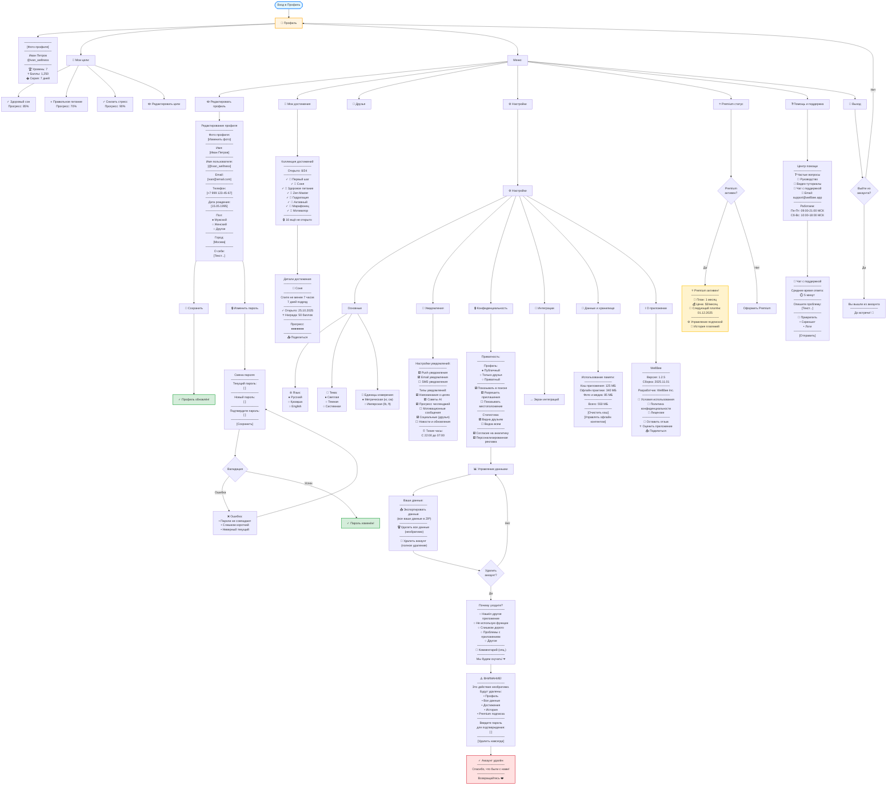
```mermaid
graph TB
    ProfileEntry([Вход в Профиль]) --> ProfileMain["👤 Профиль"]
    
    ProfileMain --> ProfileHeader["─────────────<br/>[Фото профиля]<br/>─────────────<br/>Иван Петров<br/>@ivan_wellness<br/>─────────────<br/>🏆 Уровень: 7<br/>⭐ Баллы: 1,250<br/>� Серия: 7 дней"]
    
    ProfileMain --> Goals["🎯 Мои цели:"]
    Goals --> Goal1["✓ Здоровый сон<br/>  Прогресс: 85%"]
    Goals --> Goal2["◐ Правильное питание<br/>  Прогресс: 70%"]
    Goals --> Goal3["✓ Снизить стресс<br/>  Прогресс: 90%"]
    Goals --> EditGoals["✏️ Редактировать цели"]
    
    ProfileMain --> MenuOptions["Меню:"]
    MenuOptions --> EditProfile["✏️ Редактировать профиль"]
    MenuOptions --> MyAchievements["🏅 Мои достижения"]
    MenuOptions --> FriendsLink["👥 Друзья"]
    MenuOptions --> SettingsLink["⚙️ Настройки"]
    MenuOptions --> PremiumLink["⭐ Premium статус"]
    MenuOptions --> HelpSupport["❓ Помощь и поддержка"]
    MenuOptions --> Logout["🚪 Выход"]
    
    EditProfile --> EditForm["Редактирование профиля<br/>─────────────<br/>Фото профиля:<br/>[Изменить фото]<br/>─────────────<br/>Имя:<br/>[Иван Петров]<br/>─────────────<br/>Имя пользователя:<br/>[@ivan_wellness]<br/>─────────────<br/>Email:<br/>[ivan@email.com]<br/>─────────────<br/>Телефон:<br/>[+7 999 123-45-67]<br/>─────────────<br/>Дата рождения:<br/>[15.05.1995]<br/>─────────────<br/>Пол:<br/>● Мужской<br/>○ Женский<br/>○ Другое<br/>─────────────<br/>Город:<br/>[Москва]<br/>─────────────<br/>О себе:<br/>[Текст...]"]
    
    EditForm --> SaveProfile["💾 Сохранить"]
    SaveProfile --> ProfileSaved["✓ Профиль обновлён!"]
    
    EditForm --> ChangePassword["🔒 Изменить пароль"]
    ChangePassword --> PasswordForm["Смена пароля:<br/>─────────────<br/>Текущий пароль:<br/>[          ]<br/>─────────────<br/>Новый пароль:<br/>[          ]<br/>─────────────<br/>Подтвердите пароль:<br/>[          ]<br/>─────────────<br/>[Сохранить]"]
    
    PasswordForm --> PasswordValidation{Валидация}
    PasswordValidation -->|Ошибка| PasswordError["❌ Ошибка:<br/>• Пароли не совпадают<br/>• Слишком короткий<br/>• Неверный текущий"]
    PasswordError --> PasswordForm
    PasswordValidation -->|Успех| PasswordChanged["✓ Пароль изменён!"]
    
    MyAchievements --> AchievementsGrid["Коллекция достижений<br/>─────────────<br/>Открыто: 8/24<br/>─────────────<br/>✓ 🏅 Первый шаг<br/>✓ 🏅 Соня<br/>✓ 🏅 Здоровое питание<br/>✓ 🏅 Zen Master<br/>✓ 🏅 Гидратация<br/>✓ 🏅 Активный<br/>✓ 🏅 Марафонец<br/>✓ 🏅 Мотиватор<br/>─────────────<br/>🔒 16 ещё не открыто"]
    
    AchievementsGrid --> AchievementDetail["Детали достижения<br/>─────────────<br/>🏅 Соня<br/>─────────────<br/>Спите не менее 7 часов<br/>7 дней подряд<br/>─────────────<br/>✓ Открыто: 25.10.2025<br/>⭐ Награда: 50 баллов<br/>─────────────<br/>Прогресс:<br/>●●●●●●●<br/>─────────────<br/>📤 Поделиться"]
    
    SettingsLink --> SettingsMain["⚙️ Настройки"]
    
    SettingsMain --> SettingsGeneral["Основные"]
    SettingsGeneral --> LanguageSetting["🌐 Язык:<br/>● Русский<br/>○ Қазақша<br/>○ English"]
    SettingsGeneral --> ThemeSetting["🎨 Тема:<br/>● Светлая<br/>○ Темная<br/>○ Системная"]
    SettingsGeneral --> UnitsSetting["📏 Единицы измерения:<br/>● Метрическая (кг, см)<br/>○ Имперская (lb, ft)"]
    
    SettingsMain --> SettingsNotifications["🔔 Уведомления"]
    SettingsNotifications --> NotifSettings["Настройки уведомлений:<br/>─────────────<br/>☑️ Push уведомления<br/>☑️ Email уведомления<br/>☐ SMS уведомления<br/>─────────────<br/>Типы уведомлений:<br/>☑️ Напоминания о целях<br/>☑️ Советы AI<br/>☑️ Прогресс челленджей<br/>☐ Мотивационные сообщения<br/>☑️ Социальные (друзья)<br/>☐ Новости и обновления<br/>─────────────<br/>⏰ Тихие часы:<br/>С 22:00 до 07:00"]
    
    SettingsMain --> SettingsPrivacy["🔒 Конфиденциальность"]
    SettingsPrivacy --> PrivacySettings["Приватность:<br/>─────────────<br/>Профиль:<br/>● Публичный<br/>○ Только друзья<br/>○ Приватный<br/>─────────────<br/>☑️ Показывать в поиске<br/>☑️ Разрешить приглашения<br/>☐ Показывать местоположение<br/>─────────────<br/>Статистика:<br/>☑️ Видна друзьям<br/>☐ Видна всем<br/>─────────────<br/>☑️ Согласие на аналитику<br/>☑️ Персонализированная реклама"]
    
    PrivacySettings --> DataManagement["📊 Управление данными"]
    DataManagement --> DataOptions["Ваши данные:<br/>─────────────<br/>📤 Экспортировать данные<br/>  (все ваши данные в ZIP)<br/>─────────────<br/>🗑️ Удалить все данные<br/>  (необратимо)<br/>─────────────<br/>🚪 Удалить аккаунт<br/>  (полное удаление)"]
    
    DataOptions --> DeleteAccountConfirm{Удалить<br/>аккаунт?}
    DeleteAccountConfirm -->|Да| DeleteReason["Почему уходите?<br/>─────────────<br/>○ Нашёл другое приложение<br/>○ Не использую функции<br/>○ Слишком дорого<br/>○ Проблемы с приложением<br/>○ Другое<br/>─────────────<br/>💬 Комментарий (опц.)<br/>─────────────<br/>Мы будем скучать! 💔"]
    DeleteAccountConfirm -->|Нет| DataManagement
    DeleteReason --> FinalDeleteConfirm["⚠️ ВНИМАНИЕ!<br/>─────────────<br/>Это действие необратимо.<br/>Будут удалены:<br/>• Профиль<br/>• Все данные<br/>• Достижения<br/>• История<br/>• Premium подписка<br/>─────────────<br/>Введите пароль<br/>для подтверждения:<br/>[          ]<br/>─────────────<br/>[Удалить навсегда]"]
    FinalDeleteConfirm --> AccountDeleted["✓ Аккаунт удалён<br/>─────────────<br/>Спасибо, что были с нами!<br/>─────────────<br/>Возвращайтесь ❤️"]
    
    SettingsMain --> SettingsIntegrations["🔗 Интеграции"]
    SettingsIntegrations --> IntegrationsLink["→ Экран интеграций"]
    
    SettingsMain --> SettingsData["💾 Данные и хранилище"]
    SettingsData --> StorageInfo["Использование памяти:<br/>─────────────<br/>Кэш приложения: 125 МБ<br/>Офлайн практики: 340 МБ<br/>Фото и медиа: 85 МБ<br/>─────────────<br/>Всего: 550 МБ<br/>─────────────<br/>[Очистить кэш]<br/>[Управлять офлайн контентом]"]
    
    SettingsMain --> SettingsAbout["ℹ️ О приложении"]
    SettingsAbout --> AboutInfo["WellBee<br/>─────────────<br/>Версия: 1.2.5<br/>Сборка: 2025.11.01<br/>─────────────<br/>Разработчик: WellBee Inc.<br/>─────────────<br/>📄 Условия использования<br/>📄 Политика конфиденциальности<br/>📄 Лицензии<br/>─────────────<br/>💬 Оставить отзыв<br/>⭐ Оценить приложение<br/>📤 Поделиться"]
    
    HelpSupport --> HelpCenter["Центр помощи<br/>─────────────<br/>❓ Частые вопросы<br/>📖 Руководство<br/>🎥 Видео-туториалы<br/>💬 Чат с поддержкой<br/>📧 Email: support@wellbee.app<br/>─────────────<br/>Работаем:<br/>Пн-Пт: 09:00-21:00 МСК<br/>Сб-Вс: 10:00-18:00 МСК"]
    
    HelpCenter --> ChatSupport["💬 Чат с поддержкой<br/>─────────────<br/>Среднее время ответа:<br/>⏱️ 5 минут<br/>─────────────<br/>Опишите проблему:<br/>[Текст...]<br/>─────────────<br/>📎 Прикрепить<br/>  • Скриншот<br/>  • Логи<br/>─────────────<br/>[Отправить]"]
    
    Logout --> LogoutConfirm{Выйти из<br/>аккаунта?}
    LogoutConfirm -->|Да| LoggedOut["Вы вышли из аккаунта<br/>─────────────<br/>До встречи! 👋"]
    LogoutConfirm -->|Нет| ProfileMain
    
    PremiumLink --> PremiumStatus{Premium<br/>активен?}
    PremiumStatus -->|Да| PremiumActive["⭐ Premium активен!<br/>─────────────<br/>📅 План: 1 месяц<br/>💰 Цена: $3/месяц<br/>📆 Следующий платёж:<br/>   01.12.2025<br/>─────────────<br/>⚙️ Управление подпиской<br/>📄 История платежей"]
    PremiumStatus -->|Нет| PremiumOffer["Оформить Premium"]
    
    style ProfileEntry fill:#e1f5ff,stroke:#4a9eff,stroke-width:3px
    style ProfileMain fill:#fff4e1,stroke:#ffa500,stroke-width:2px
    style ProfileSaved fill:#d4edda,stroke:#28a745,stroke-width:2px
    style PasswordChanged fill:#d4edda,stroke:#28a745,stroke-width:2px
    style AccountDeleted fill:#ffe1e1,stroke:#dc3545,stroke-width:2px
    style PremiumActive fill:#fff3cd,stroke:#ffc107,stroke-width:2px
```

---

### 14. СИСТЕМА УВЕДОМЛЕНИЙ - Детальный Flow


```mermaid
graph TB
    NotifSystem([Система уведомлений<br/>Фоновая работа]) --> Triggers["Триггеры уведомлений"]
    
    Triggers --> TimeBased["⏰ По времени"]
    Triggers --> EventBased["🎯 По событиям"]
    Triggers --> AIBased["🤖 AI-рекомендации"]
    
    TimeBased --> Morning["🌅 Утреннее (08:00)<br/>─────────────<br/>'Доброе утро! ☀️<br/>Не забудьте выпить<br/>стакан воды 💧'<br/>─────────────<br/>Действия:<br/>• Открыть трекер воды<br/>• Отложить на 30 мин<br/>• Отключить"]
    
    TimeBased --> Afternoon["☀️ Дневное (12:00)<br/>─────────────<br/>'Время для короткой<br/>медитации 🧘<br/>5 минут для себя'<br/>─────────────<br/>Действия:<br/>• Начать практику<br/>• Отложить<br/>• Пропустить"]
    
    TimeBased --> Evening["🌆 Вечернее (22:00)<br/>─────────────<br/>'Через час пора спать 🌙<br/>Начать вечернюю рутину?'<br/>─────────────<br/>Действия:<br/>• Начать рутину<br/>• Напомнить позже<br/>• Отменить"]
    
    Morning -->|Клик| OpenWaterTracker["Открыть трекер воды"]
    Afternoon -->|Клик| OpenPractices["Открыть практики"]
    Evening -->|Клик| StartRoutine["Запустить вечернюю рутину"]
    
    StartRoutine --> Routine["Вечерняя рутина:<br/>─────────────<br/>1. 🧘 Медитация (10 мин)<br/>2. 📖 Чтение (15 мин)<br/>3. 🌡️ Снизить температуру<br/>4. 📵 Убрать телефон<br/>5. 🌙 Трекер сна"]
    
    EventBased --> ChallengeProgress["🏆 Прогресс челленджа<br/>─────────────<br/>'Отлично! 🎉<br/>День 5/7 выполнен!<br/>Еще 2 дня до награды'<br/>─────────────<br/>• Посмотреть прогресс<br/>• Поделиться"]
    
    EventBased --> GoalAchieved["� Цель достигнута<br/>─────────────<br/>'Поздравляем! ⭐<br/>Вы выполнили дневную<br/>цель по питанию!'<br/>─────────────<br/>• Посмотреть статистику<br/>• Получить баллы"]
    
    EventBased --> FriendActivity["👥 Активность друга<br/>─────────────<br/>'Анна завершила челлендж<br/>7 дней здорового сна! 🎉<br/>Поздравьте её!'<br/>─────────────<br/>• Отправить поздравление<br/>• Посмотреть профиль"]
    
    EventBased --> StreakMilestone["🔥 Веха серии<br/>─────────────<br/>'Невероятно! 🔥<br/>7 дней подряд!<br/>Вы получили бейдж'<br/>─────────────<br/>• Посмотреть бейдж<br/>• Поделиться"]
    
    AIBased --> PersonalizedTip["💡 Персональный совет<br/>─────────────<br/>'На основе ваших данных:<br/>Попробуйте ужинать<br/>за 3 часа до сна.<br/>Это улучшит качество сна'<br/>─────────────<br/>• Узнать больше<br/>• Применить совет<br/>• Отклонить"]
    
    AIBased --> HealthAlert["⚠️ Важное замечание<br/>─────────────<br/>'Внимание! ⚠️<br/>Качество вашего сна<br/>снизилось на 20%.<br/>Рекомендуем консультацию'<br/>─────────────<br/>• Анализ AI<br/>• Связаться с врачом<br/>• Игнорировать"]
    
    AIBased --> MotivationalPush["💪 Мотивация<br/>─────────────<br/>'Вы отлично справляетесь! 💪<br/>Еще немного усилий<br/>и цель достигнута!'<br/>─────────────<br/>• Продолжить<br/>• Посмотреть прогресс"]
    
    AIBased --> WeatherBased["🌦️ На основе погоды<br/>─────────────<br/>'Сегодня солнечно! ☀️<br/>Отличный день для<br/>прогулки на свежем воздухе'<br/>─────────────<br/>• Запланировать прогулку<br/>• Отложить"]
    
    NotifSystem --> NotifPreferences["⚙️ Настройки уведомлений"]
    NotifPreferences --> EnableDisable["Включить/Выключить:<br/>─────────────<br/>☑️ Push уведомления<br/>☑️ Напоминания<br/>☑️ Советы AI<br/>☑️ Социальные<br/>☐ Рекламные<br/>─────────────<br/>⏰ Тихие часы:<br/>22:00 - 07:00"]
    
    NotifPreferences --> NotifChannels["Каналы:<br/>─────────────<br/>☑️ Баннер на экране<br/>☑️ Звук<br/>☑️ Вибрация<br/>☑️ На экране блокировки<br/>☑️ В центре уведомлений"]
    
    NotifSystem --> NotifHistory["📜 История уведомлений"]
    NotifHistory --> HistoryList["Последние уведомления:<br/>─────────────<br/>Сегодня, 22:00<br/>🌙 Время спать<br/>─────────────<br/>Сегодня, 12:00<br/>🧘 Медитация<br/>─────────────<br/>Сегодня, 08:00<br/>☀️ Доброе утро!<br/>─────────────<br/>Вчера, 18:30<br/>🏆 Челлендж завершён<br/>─────────────<br/>[Очистить всё]"]
    
    NotifSystem --> SmartNotif["🧠 Умные уведомления"]
    SmartNotif --> SmartFeatures["AI оптимизация:<br/>─────────────<br/>✓ Подбор времени<br/>  (когда вы чаще активны)<br/>✓ Персонализация контента<br/>  (на основе предпочтений)<br/>✓ Частота отправки<br/>  (чтобы не надоедать)<br/>✓ Приоритизация<br/>  (важное в первую очередь)"]
    
    style NotifSystem fill:#f0e1ff,stroke:#9b59b6,stroke-width:3px
    style Morning fill:#fff4e1,stroke:#ffa500,stroke-width:2px
    style Afternoon fill:#e1f5ff,stroke:#4a9eff,stroke-width:2px
    style Evening fill:#e1f0ff,stroke:#4a9eff,stroke-width:2px
    style GoalAchieved fill:#d4edda,stroke:#28a745,stroke-width:2px
    style HealthAlert fill:#ffe1e1,stroke:#dc3545,stroke-width:2px
    style SmartNotif fill:#f0e1ff,stroke:#9b59b6,stroke-width:2px
```

---

## КЛЮЧЕВЫЕ ПУТИ ПОЛЬЗОВАТЕЛЕЙ

### Путь 1: Новый пользователь (First Time User Experience)
```
Скачивание → Онбординг → Выбор языка → Регистрация → 
Создание профиля → Установка целей → Главный экран → 
Первый челлендж
```

### Путь 2: Ежедневное использование
```
Открытие → Главный экран → Просмотр прогресса → 
Добавление данных (сон/питание) → AI советы → 
Практика (медитация) → Закрытие
```

### Путь 3: Путь к Premium
```
Попытка доступа к закрытому контенту → Экран Premium → 
Выбор плана → Оплата → Активация → Доступ к контенту
```

### Путь 4: Социальное взаимодействие
```
Профиль → Друзья → Добавить друга → 
Сравнить прогресс → Совместный челлендж → Мотивация
```

---

## НАВИГАЦИОННАЯ СТРУКТУРА

```
                    [WellBee App]
                         │
        ┌────────────────┼────────────────┐
        │                │                │
    [Онбординг]    [Главный экран]  [Регистрация]
                         │
        ┌────────┬───────┼───────┬────────┐
        │        │       │       │        │
    [Трекеры] [AI]  [Челленджи] [Статистика] [Профиль]
        │        │       │       │        │
    ┌───┴───┐    │       │       │    ┌───┴───┐
  [Сон] [Питание] │     │       │  [Настройки] [Друзья]
                  │     │       │
            [Чат с AI] │  [Графики]
                      │
              [Практики]
                  │
          ┌───────┴───────┐
      [Медитация]  [Дыхание]
```

---

## ИНСТРУКЦИЯ ПО СОЗДАНИЮ В MIRO

### Шаг 1: Подготовка
1. Создайте новую доску в Miro
2. Используйте шаблон "User Flow" или начните с пустой доски

### Шаг 2: Элементы для использования
- **Прямоугольники** (голубые) - для экранов приложения
- **Ромбы** - для точек принятия решений
- **Стрелки** - для потоков и переходов
- **Заметки** - для AI-советов и уведомлений
- **Иконки** - для обозначения типов контента

### Шаг 3: Цветовая схема
- 🔵 Голубой - основные экраны и действия
- 🟢 Зелёный - успешные действия, завершения
- 🟡 Жёлтый - Premium функции
- 🔴 Красный - точки выхода, отмены
- 🟣 Фиолетовый - AI и автоматические действия

### Шаг 4: Структура
1. Разместите основные разделы горизонтально
2. Детальные потоки размещайте вертикально под разделами
3. Используйте фреймы для группировки связанных экранов
4. Добавьте легенду с обозначениями

### Шаг 5: Интерактивность
- Используйте ссылки между экранами
- Добавьте описания к переходам
- Включите условия (if/else) через ромбы

---

## ДОПОЛНИТЕЛЬНЫЕ ЗАМЕТКИ

### Точки монетизации:
1. Premium подписка ($2-3/мес)
2. Блокировка продвинутых практик
3. Интеграции с устройствами
4. Детальная аналитика

### Точки вовлечения:
1. Ежедневные челленджи
2. AI персонализация
3. Геймификация (баллы, уровни)
4. Социальное сравнение

### Критические моменты:
1. Первые 3 дня использования
2. Момент перехода на Premium
3. Добавление первого друга
4. Завершение первого челленджа

---

**Создано для проекта WellBee**  
*Мобильное приложение для здоровья и благополучия*

